# PSA — Platform Security Architecture
## From Zero to Hero: A Comprehensive Guide to ARM's Security Foundation

> *"Security is not a product, but a process."* — Bruce Schneier
>
> PSA is the embodiment of that idea, brought to silicon.

---

## Table of Contents

**Part I — Foundations**
1. [Why PSA Exists: The IoT Security Crisis](#1-why-psa-exists-the-iot-security-crisis)
2. [The Philosophy of PSA](#2-the-philosophy-of-psa)
3. [Core Definitions: The Vocabulary of Trust](#3-core-definitions-the-vocabulary-of-trust)

**Part II — The PSA Framework**
4. [The Four-Step Methodology: Analyze, Architect, Implement, Certify](#4-the-four-step-methodology)
5. [The Ten Security Goals](#5-the-ten-security-goals)
6. [Anatomy of a PSA System](#6-anatomy-of-a-psa-system)

**Part III — Architecture Deep Dive**
7. [Roots of Trust](#7-roots-of-trust)
8. [SPE vs NSPE: The Two Worlds](#8-spe-vs-nspe-the-two-worlds)
9. [Isolation Levels 1, 2, 3](#9-isolation-levels-1-2-3)
10. [Trusted Firmware-M (TF-M)](#10-trusted-firmware-m-tf-m)

**Part IV — The PSA Functional APIs**
11. [PSA Crypto API](#11-psa-crypto-api)
12. [PSA Storage APIs (ITS & PS)](#12-psa-storage-apis)
13. [PSA Attestation API](#13-psa-attestation-api)
14. [PSA Secure Boot & Firmware Update](#14-psa-secure-boot--firmware-update)

**Part V — PSA & Mbed TLS**
15. [Mbed TLS: The Ancestor and the Reference](#15-mbed-tls-the-ancestor-and-the-reference)
16. [The Integration Story](#16-the-integration-story)
17. [Migration Patterns and Use Cases](#17-migration-patterns-and-use-cases)

**Part VI — Mastery**
18. [PSA Certified: Levels 1, 2, 3](#18-psa-certified-levels-1-2-3)
19. [Threat Modeling the PSA Way](#19-threat-modeling-the-psa-way)
20. [Becoming a PSA Expert: Roadmap](#20-becoming-a-psa-expert-roadmap)

---

# Part I — Foundations

## 1. Why PSA Exists: The IoT Security Crisis

### The problem in one sentence

By 2030, the world will have tens of billions of connected devices, and the overwhelming majority of them are built by companies whose core competence is **not** security.

A washing machine vendor knows water pumps. A lightbulb vendorv knows LEDs. A meter vendor knows electricity. None of them want to become cryptography experts — yet every one of them now ships products that can be attacked over the Internet.

### What was happening before PSA

Before PSA was published by Arm in 2017, the embedded/IoT world looked like this:

```mermaid
flowchart TB
    subgraph Before["The Pre-PSA Landscape (chaos)"]
        direction TB
        V1["Vendor A<br/>Custom crypto"] -.->|reinvents| W1["Custom RoT"]
        V2["Vendor B<br/>Copies sample code"] -.->|hardcodes keys| W2["No RoT at all"]
        V3["Vendor C<br/>Uses a library"] -.->|forgets updates| W3["Stale crypto"]
        V4["Vendor D<br/>Outsources"] -.->|black box| W4["Unknown trust"]
        V1 --> P[("Devices<br/>shipped"))]
        V2 --> P
        V3 --> P
        V4 --> P
        P --> ATK[("🔥 Mirai, Stuxnet,<br/>BrickerBot, Reaper..."))]
    end

    style ATK fill:#ff6b6b,stroke:#c0392b,color:#fff
    style P fill:#f39c12,stroke:#d35400,color:#fff
```

The result was a series of high-profile disasters:

- **Mirai (2016)** — hijacked 600,000 IoT devices using **61 hard-coded credentials**.
- **BrickerBot (2017)** — permanently destroyed insecure devices.
- **VPNFilter (2018)** — half a million routers compromised.

Every one of those incidents shared the same root cause: *the device had no way to anchor trust in hardware, and no standard framework told the manufacturer what "secure" even meant*.

### The PSA insight

Arm — whose CPU cores power virtually every smartphone and a huge fraction of all microcontrollers — realized something the rest of the industry was slow to accept:

> **Security has to be a horizontal property of the platform, designed in from silicon to cloud, and it must be the same shape for every product.**

PSA is Arm's answer. It is **not** a product, **not** a chip, and **not** a piece of code. It is a **specification family** plus a **certification scheme** plus a **reference implementation**.

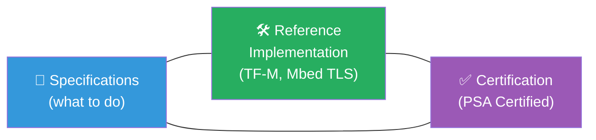

Together those three pieces give every silicon vendor, every OEM, and every developer a **shared language** for "is this thing secure?"

---

## 2. The Philosophy of PSA

PSA rests on five philosophical pillars. Internalize these and the rest of the standard becomes obvious.

### Pillar 1 — Security is a *property of the platform*, not a feature of the app

A traditional developer thinks: *"I'll add TLS to my product."* PSA inverts this: the **platform** provides cryptography, secure storage, attestation, and secure boot **as services**, and the application simply uses them. The app developer never touches a private key.

```mermaid
flowchart TB
    subgraph Old["❌ App-centric security"]
        A1[Application] --> K1[("Hard-coded<br/>keys"))]
        A1 --> C1["Copy-pasted<br/>crypto"]
    end
    subgraph New["✅ Platform-centric security (PSA)"]
        A2[Application] -->|PSA Crypto API| P2[Platform]
        P2 --> H2[("HW-anchored<br/>keys"))]
        P2 --> C2[Vetted<br/>crypto core]
    end
    style Old fill:#fadbd8
    style New fill:#d5f5e3
```

### Pillar 2 — Anchor trust in hardware (Root of Trust)

Software can be patched. Software can lie. Software can be tampered with. Therefore the **starting point** of trust must be something that *cannot* be modified: a piece of immutable hardware (a fuse, a ROM, a secure element). Everything trusted is verified by something more trusted, and the chain ends at a hardware root.

> **If your security depends on something that can be reflashed, your security can be reflashed.**

### Pillar 3 — Isolate, then mediate

Critical assets (private keys, identity, audit logs) live in a **Secure Processing Environment (SPE)**. Application code lives in a **Non-Secure Processing Environment (NSPE)**. The two worlds communicate **only** through a narrow, well-defined API, and the SPE never trusts anything the NSPE says.

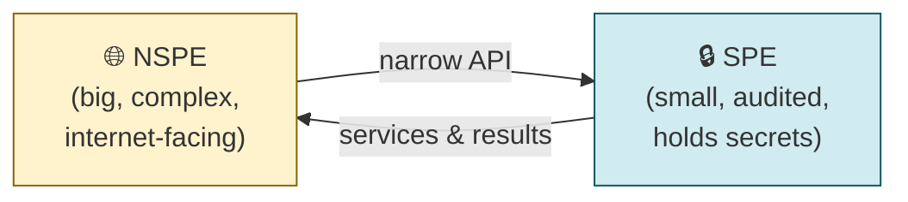

This is the **principle of least privilege** applied at the hardware level: the big, vulnerable code never gets to touch the things that matter.

### Pillar 4 — Standardize the interface, not the implementation

PSA does **not** tell you which silicon to use, which OS to run, or which crypto library to ship. It defines **APIs** (function signatures, behaviors, error codes) that every PSA platform must expose. A developer writing against `psa_crypto.h` runs unchanged on an STM32 with TF-M, an NXP chip with EdgeLock, or a Nordic chip with their own SPE.

This is the **portability principle**: write once, attest anywhere.

### Pillar 5 — Trust must be *verifiable*, not just *claimed*

Anyone can put "secure" on a box. PSA introduces **attestation**: the device produces a cryptographically signed report — a *token* — that proves to a remote party (a cloud service, a fleet manager) which firmware it is running, that it booted securely, and that it is the device it claims to be. Trust without attestation is marketing.

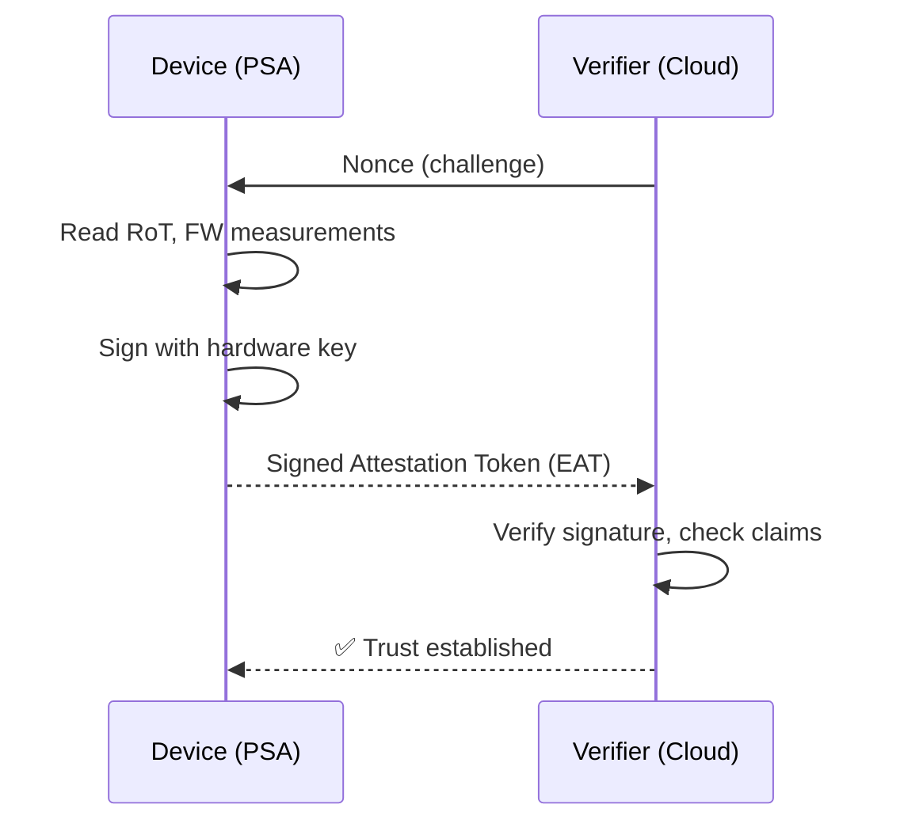

### Putting it together

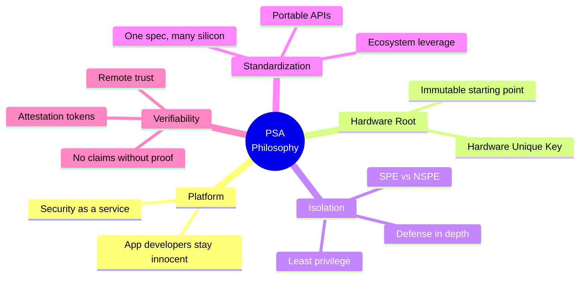

---

## 3. Core Definitions: The Vocabulary of Trust

Before we go further, lock these terms in. PSA documents are dense with them.

| Term | Acronym | Definition (plain English) |
|---|---|---|
| **Platform Security Architecture** | PSA | The Arm-led specification family that defines how a connected device should be made secure, end-to-end. |
| **Root of Trust** | RoT | The component (usually hardware) that is **inherently trusted** because it cannot be modified. Everything else derives trust from it. |
| **PSA Root of Trust** | PSA-RoT | The specific RoT defined by PSA: a combination of hardware (HW RoT) and a small piece of trusted firmware. |
| **Hardware Unique Key** | HUK | A symmetric key fused into each chip at manufacture, **never readable by software**. Used to derive other keys. |
| **Secure Processing Environment** | SPE | The protected world where secrets and trusted code live. |
| **Non-Secure Processing Environment** | NSPE | The "normal" world where the OS, libraries, and application live. |
| **Trusted Firmware-M** | TF-M | The open-source **reference implementation** of the PSA SPE for Armv8-M / Cortex-M. |
| **Secure Partition** | SP | An isolated trusted service running inside the SPE (e.g., Crypto SP, Storage SP). |
| **Secure Partition Manager** | SPM | The kernel-like dispatcher inside the SPE that schedules SPs and mediates IPC. |
| **PSA Functional API** | — | Standardized C APIs (Crypto, Storage, Attestation, Firmware Update) that NSPE code calls. |
| **Internal Trusted Storage** | ITS | On-chip, tamper-resistant key/value storage. |
| **Protected Storage** | PS | Off-chip storage made trustworthy via cryptography (encryption + integrity). |
| **Initial Attestation** | — | The PSA service that produces a signed token describing device identity and state. |
| **Entity Attestation Token** | EAT | The format (CBOR/COSE, IETF standard) PSA uses for attestation reports. |
| **Secure Boot** | — | Boot process where each stage cryptographically verifies the next. |
| **Chain of Trust** | CoT | The transitive trust relationship: RoT → bootloader → firmware → application. |
| **Threat Model** | — | The structured analysis of what can go wrong, who can cause it, and how bad the impact is. |
| **PSA Certified** | — | Independent, lab-based certification scheme (Levels 1–3) confirming a product meets PSA. |
| **TrustZone** | TZ | Arm's hardware feature that physically partitions a CPU into secure/non-secure states; the most common HW substrate for PSA. |

### How they relate visually

```mermaid
flowchart TB
    HW[("🔩 Silicon: HUK,<br/>fuses, TrustZone"))] --> HRoT["HW Root of Trust"]
    HRoT --> PRoT["PSA Root of Trust"]
    PRoT --> SPE["Secure Processing Environment"]
    SPE --> SP1["Crypto SP"]
    SPE --> SP2["Storage SP (ITS/PS)"]
    SPE --> SP3["Attestation SP"]
    SPE --> SP4["Firmware Update SP"]
    SP1 -->|PSA Crypto API| APP["📱 NSPE Application"]
    SP2 -->|PSA Storage API| APP
    SP3 -->|PSA Attestation API| APP
    SP4 -->|PSA FWU API| APP

    style HW fill:#34495e,color:#fff
    style HRoT fill:#2c3e50,color:#fff
    style PRoT fill:#16a085,color:#fff
    style SPE fill:#27ae60,color:#fff
    style APP fill:#3498db,color:#fff
```

This single diagram is the **mental model** of PSA. Every other diagram in this document is a zoom into one part of it.

---

# Part II — The PSA Framework

## 4. The Four-Step Methodology

PSA is not just a set of APIs; it is also a **process**. Arm prescribes four phases that any team building a connected product should follow, in order.


### Step 1 — Analyze (threat model)
Identify your **assets** (firmware, keys, user data, identity), the **adversaries** who want them (network attacker, local attacker, malicious insider, supply-chain attacker), and the **attack surfaces** they can reach. Output: a threat model document.

PSA publishes **Protection Profiles** — pre-baked threat models — for common product classes (smart speaker, smart meter, asset tracker, network camera). You can usually start from one of those.

### Step 2 — Architect (security model)
Map the threats from Step 1 onto PSA's primitives: *which assets need confidentiality? which need integrity? where does the trust boundary go? what isolation level is required?* Output: a security architecture diagram.

### Step 3 — Implement
Use a PSA-Certified chip + TF-M (or another PSA SPE) + the PSA Functional APIs from your application code. Do **not** roll your own crypto. Do **not** invent your own boot scheme.

### Step 4 — Certify
Submit to a PSA Certified evaluation lab. The lab issues a certificate at Level 1, 2, or 3 (covered in §18).

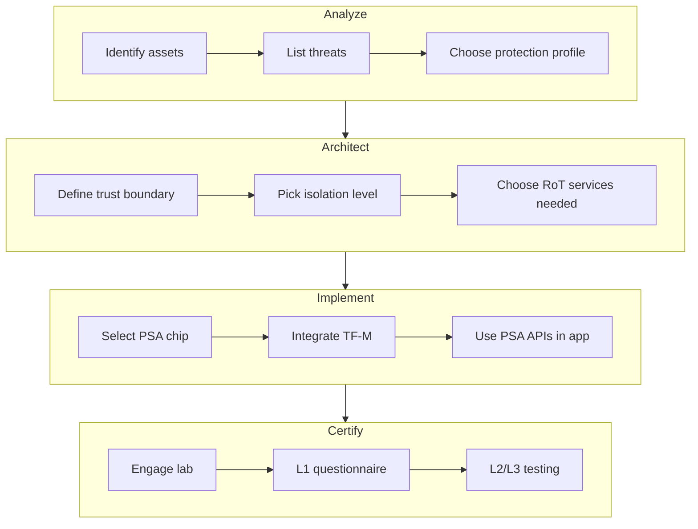

---

## 5. The Ten Security Goals

PSA distills "what must a connected device do?" into **ten goals**. Memorize them — they are the rubric every PSA evaluation uses.

| # | Goal | Plain meaning |
|---|---|---|
| 1 | **Unique identity** | Every device has a non-clonable identity rooted in hardware. |
| 2 | **Secure boot** | Only authentic, integrity-checked firmware runs. |
| 3 | **Secure update** | Firmware can be updated, only by legitimate authority, and rollback is controlled. |
| 4 | **Anti-rollback** | An attacker cannot force a downgrade to a vulnerable old firmware. |
| 5 | **Isolation** | Trusted code is isolated from untrusted code. |
| 6 | **Interaction** | Inter-domain calls are mediated through controlled, vetted interfaces. |
| 7 | **Secure storage** | Secrets are stored such that confidentiality and integrity are preserved at rest. |
| 8 | **Cryptography** | Strong, modern, correctly implemented crypto is available as a service. |
| 9 | **Attestation** | The device can prove its identity and state to a remote verifier. |
| 10 | **Audit / debug control** | Debug interfaces are off, locked, or strongly authenticated in production. |

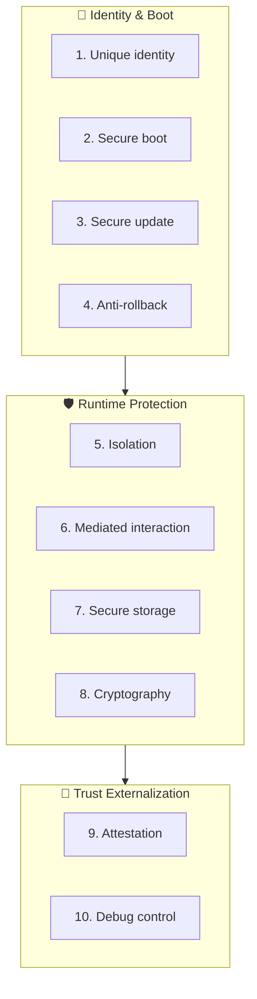

Each goal maps to one or more PSA Functional APIs and TF-M services, which we'll meet later.

---

## 6. Anatomy of a PSA System

The reference PSA system stack — silicon at the bottom, your app at the top — looks like this:

```mermaid
flowchart TB
    subgraph NSPE["🌐 Non-Secure Processing Environment (NSPE)"]
        APP["Your Application"]
        OS["RTOS / bare-metal<br/>(FreeRTOS, Zephyr, …)"]
        MTLS_NS["Mbed TLS (NS side)<br/>or any TLS lib"]
        VENEER["NSC veneers<br/>(callable secure entry)"]
        APP --> OS --> MTLS_NS --> VENEER
    end

    subgraph SPE["🔒 Secure Processing Environment (SPE) — TF-M"]
        SPM["Secure Partition Manager<br/>(SPM)"]
        SP_C["Crypto SP<br/>(uses Mbed TLS<br/>as backend)"]
        SP_S["Storage SP<br/>(ITS + PS)"]
        SP_A["Attestation SP"]
        SP_F["Firmware Update SP"]
        SPM --> SP_C
        SPM --> SP_S
        SPM --> SP_A
        SPM --> SP_F
    end

    subgraph BL["🥾 Boot Layer"]
        BL2["MCUboot /<br/>BL2 secure bootloader"]
    end

    subgraph HW["🔩 Hardware Root of Trust"]
        TZ["TrustZone-M"]
        HUK[("HUK fuses"))]
        ROM["Boot ROM (immutable)"]
        TRNG["TRNG"]
        ROM --> TZ
        TZ --> HUK
        TZ --> TRNG
    end

    VENEER -.->|"PSA API call<br/>(crosses S/NS boundary)"| SPM
    SPE --> BL
    BL --> HW

    style NSPE fill:#fff3cd
    style SPE fill:#d1ecf1
    style BL fill:#f8d7da
    style HW fill:#d6d8db
```

Read this diagram carefully — it is the **canonical PSA architecture**. The rest of Part III explains each layer.

---

# Part III — Architecture Deep Dive

## 7. Roots of Trust

### Why "root"?

Cryptography lets you **transitively** trust things: if I trust `A`, and `A` signs `B`, I now trust `B`. But every chain has to start somewhere — at something I trust **without proof**. That starting point is the **Root of Trust**.

### PSA's three layers of RoT

PSA decomposes the RoT into three concentric layers:

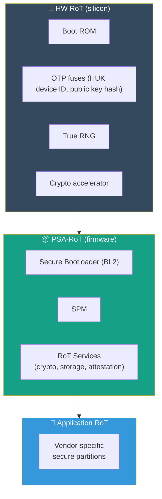

- **HW RoT** — the immutable silicon: boot ROM, fuses, accelerator, TRNG. *Cannot be patched, ever.*
- **PSA-RoT** — the trusted firmware that the HW RoT verifies and launches: bootloader + SPM + the four core RoT services (crypto, storage, attestation, firmware update). *Updatable, but only via signed update.*
- **Application RoT** — vendor-specific trusted services (e.g., a fingerprint matcher, a payment kernel) that live in the SPE alongside the PSA-RoT services.

### The Hardware Unique Key (HUK)

Every PSA chip is provisioned at manufacture with a **HUK**, a symmetric key burned into one-time-programmable fuses. Crucial properties:

1. **Per-device unique** — no two chips share a HUK.
2. **Software-invisible** — no instruction sequence can read it; only the on-chip crypto block can use it.
3. **Used as a *derivation* root** — every other key the device needs (storage encryption key, identity key, attestation key) is derived from the HUK via a KDF (HKDF, typically). If the HUK is the trunk, every other key is a branch.

```mermaid
flowchart LR
    HUK[("🗝 HUK<br/>(in fuses)"))] -->|HKDF| K1["Storage<br/>encryption key"]
    HUK -->|HKDF| K2["Initial<br/>attestation key"]
    HUK -->|HKDF| K3["Application<br/>seed keys"]
    HUK -->|HKDF| K4["Per-session<br/>session keys"]
    style HUK fill:#c0392b,color:#fff
```

This is why "extracting the HUK" is the holy grail of physical attacks against IoT devices — and why PSA Level 3 specifically tests resistance to that class of attack (see §18).

---

## 8. SPE vs NSPE: The Two Worlds

### The fundamental split

A PSA system has **two execution environments** running on (potentially) the same CPU:

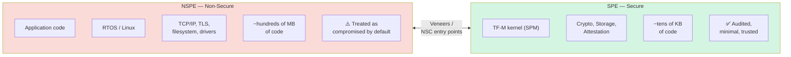

The NSPE is **big** (millions of lines, written by many people, attached to the network) and therefore **assumed compromised**. The SPE is **small** (tens of thousands of lines, one team, audited) and therefore **trusted**.

### How the split is enforced

On Cortex-M (Armv8-M) chips, PSA uses **TrustZone-M**:

- The CPU has two states: Secure and Non-Secure.
- Memory is partitioned (via SAU — Security Attribution Unit, and IDAU — Implementation-Defined Attribution Unit) into Secure / Non-Secure / Non-Secure Callable (NSC) regions.
- Non-Secure code can only enter Secure state by jumping into an **NSC veneer** — a tiny stub of code in the NSC region whose first instruction is `SG` (Secure Gateway). Any other entry point is hardware-blocked.

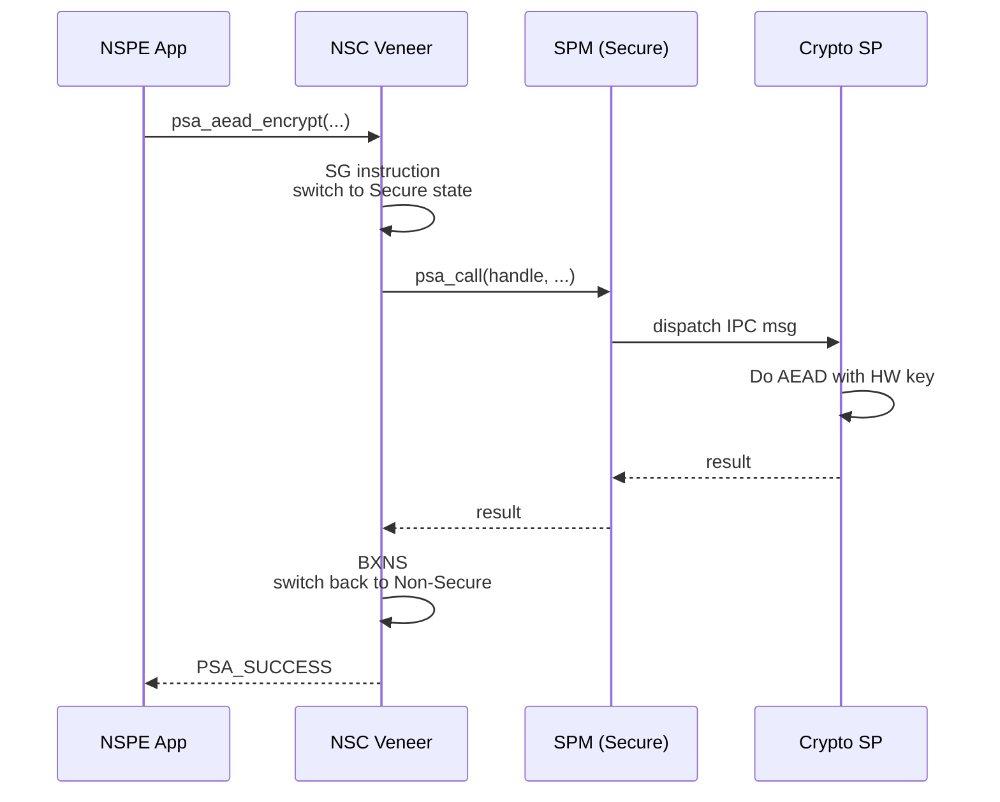

The **only** way the application can use a key is by asking the SPE through this gateway. The key itself never leaves Secure state.

### On Cortex-A (Armv8-A)
On application processors (phones, gateways), PSA-style isolation uses **TrustZone-A**, with a Trusted Execution Environment (TEE) such as **OP-TEE** running secure-side, and the rich OS (Linux, Android) in the non-secure world. The principle is identical; only the implementation differs.

---

## 9. Isolation Levels 1, 2, 3

PSA defines three increasing isolation strengths. Higher = stronger separation = harder to attack = more cost in code/RAM.

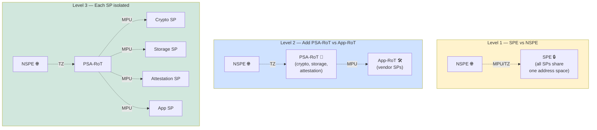

| Level | What's separated | Typical use |
|---|---|---|
| **1** | NSPE ↔ SPE only | Cost-sensitive sensors, simple peripherals |
| **2** | + PSA-RoT ↔ Application-RoT | Connected appliances, gateways |
| **3** | + Each Secure Partition is mutually isolated | Payment, identity, regulated devices |

A vulnerability in one Level-3 SP cannot reach into another SP — even though they're all in the SPE. This is **defense in depth at the firmware level**.

---

## 10. Trusted Firmware-M (TF-M)

### What TF-M is

**TF-M** (Trusted Firmware-M) is the **open-source, Apache-2.0-licensed reference implementation** of the PSA SPE for Armv8-M MCUs. Maintained by the Trusted Firmware project (a Linaro-hosted neutral foundation), it is what most PSA Cortex-M devices actually run inside their secure world.

> **PSA is a spec. TF-M is the code that meets the spec.**
>
> You don't *have to* use TF-M (a vendor can write their own SPE), but most do, because it's free, audited, and PSA-Certified out of the box.

### TF-M components

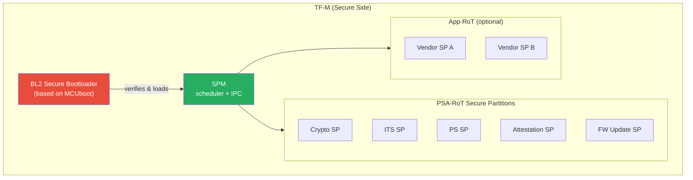

### TF-M boot flow

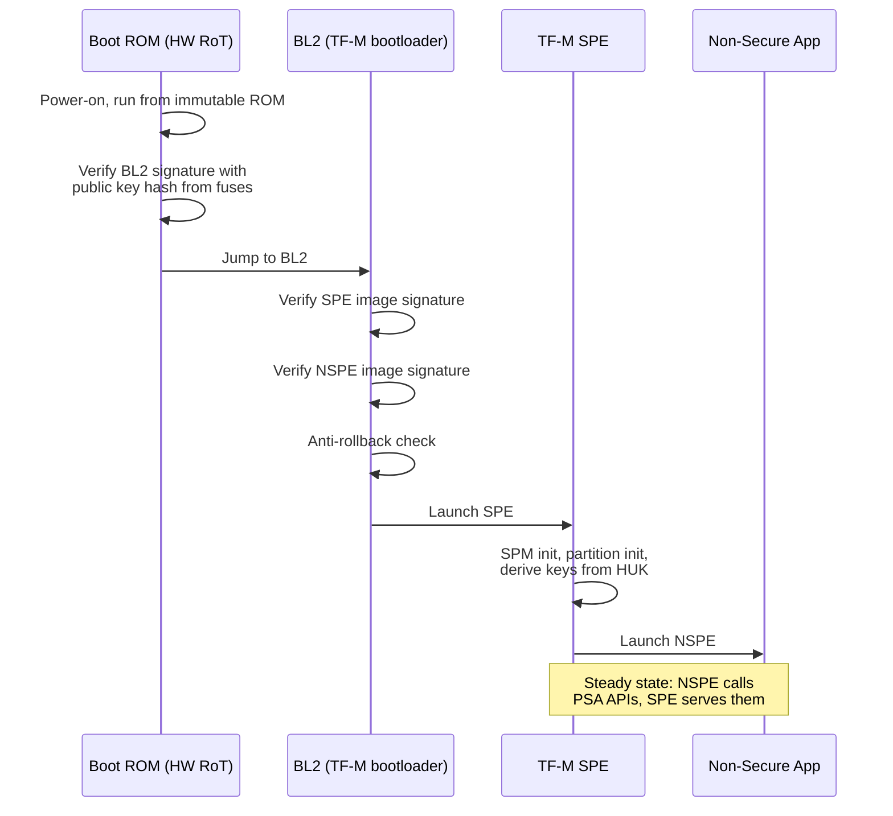

Every transition is **measured** (hashed) and the measurements feed into attestation, so a remote verifier can later see exactly what booted.

### IPC: How NSPE talks to SPE in TF-M

TF-M offers two service models:

1. **Library model** — direct function calls (Level 1 only, simpler, smaller).
2. **IPC model** — proper message passing through the SPM (required for Level 2/3, isolates partitions from each other).

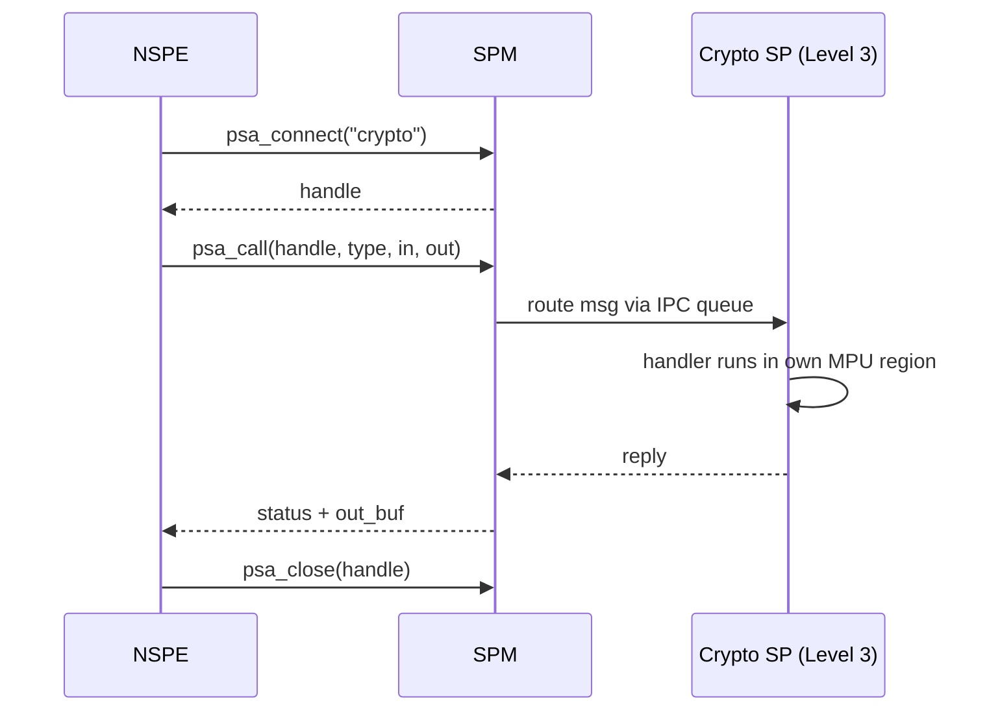

This is conceptually identical to a microkernel IPC (think L4, Mach, or seL4) — and that is no accident. PSA borrows directly from microkernel research because the goal is the same: **shrink the trusted computing base**.

---

# Part IV — The PSA Functional APIs

The four PSA Functional APIs are the **public face** of PSA. They are what you, the application developer, actually `#include` and call. Each is specified in a stable, versioned document:

| API | Header | What it does | Spec |
|---|---|---|---|
| Crypto | `psa/crypto.h` | Encrypt, sign, hash, key management | PSA Cryptography API |
| Internal Trusted Storage | `psa/internal_trusted_storage.h` | On-chip key/value | PSA Storage API |
| Protected Storage | `psa/protected_storage.h` | Off-chip key/value (encrypted) | PSA Storage API |
| Initial Attestation | `psa/initial_attestation.h` | Produce signed device-state token | PSA Attestation API |
| Firmware Update | `psa/update.h` | Stage and install signed firmware | PSA Firmware Update API |

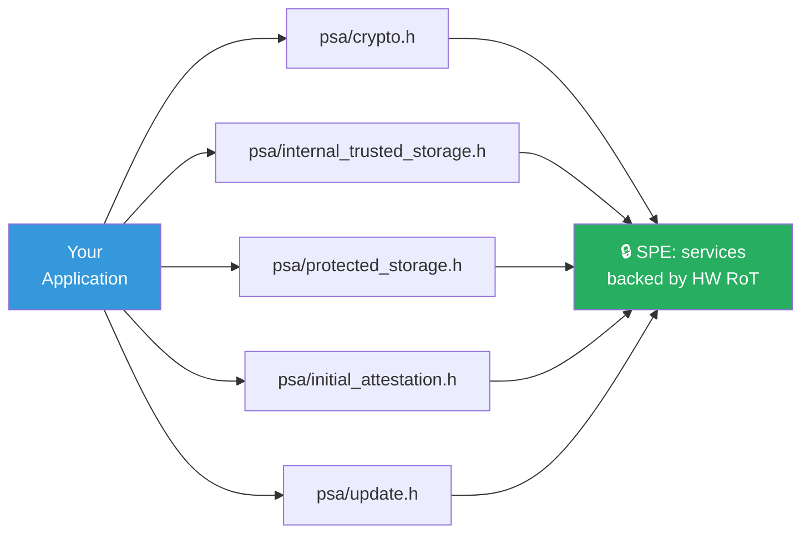

Let's go through them.

---

## 11. PSA Crypto API

### Goal

Replace the dozens of incompatible crypto libraries with **one** portable interface — and crucially, design the interface so that **keys can stay opaque**.

### The key idea: opaque keys via handles

In OpenSSL or older Mbed TLS, you typically held a `mbedtls_pk_context` whose private exponent was in your application's RAM. PSA breaks that pattern: you ask for a **key handle** (a small integer), and the actual key material lives in the SPE. You can use the key — to sign, to encrypt — but you can never read it back.

```mermaid
flowchart LR
    subgraph NSPE_C["NSPE — your code"]
        H[("handle:<br/>0x4001"))]
    end
    subgraph SPE_C["SPE — secure storage"]
        K[("Actual private key<br/>(never leaves)"))]
    end
    H -.->|references| K
    style H fill:#fff3cd
    style K fill:#d5f5e3
```

If your application is compromised, the attacker gets the handle — which is useless without the SPE's cooperation.

### The data model

Three core concepts:

1. **Key attributes** (`psa_key_attributes_t`) — describe the key: type (AES, ECC, RSA), size, lifetime, usage policy, allowed algorithms.
2. **Key handle / key id** (`psa_key_id_t`) — opaque identifier, returned by import/generate.
3. **Operation contexts** (e.g. `psa_hash_operation_t`, `psa_aead_operation_t`) — multi-step state machines.

### Lifetimes

PSA classifies keys by **lifetime**:

| Lifetime | Meaning |
|---|---|
| `PSA_KEY_LIFETIME_VOLATILE` | RAM only, gone on reset |
| `PSA_KEY_LIFETIME_PERSISTENT` | Stored in ITS, survives reset |
| Custom (vendor) | E.g., stored in an external secure element |

This abstraction lets your code be **silicon-agnostic**: the same `psa_sign_hash()` call works whether the key sits in TF-M's ITS, in an Arm CryptoCell accelerator, or in an external SE050 secure element. The PSA driver layer routes the operation to the right backend.

```mermaid
flowchart TB
    APP2["psa_sign_hash(key_id, …)"] --> CORE["PSA Crypto Core<br/>(dispatch)"]
    CORE -->|software| SW["Mbed TLS<br/>software impl"]
    CORE -->|on-chip HW| HW2["CryptoCell /<br/>NXP CAAM"]
    CORE -->|external| SE["SE050 / OPTIGA<br/>(via I²C)"]
    style CORE fill:#9b59b6,color:#fff
```

This is called the **PSA driver interface** and is one of PSA's most underrated features — it's what makes the spec future-proof against new silicon.

### A complete worked example

A canonical PSA Crypto sequence: import an AES-256 key, then encrypt a message with AES-GCM.

```c
#include <psa/crypto.h>

psa_status_t encrypt_demo(void)
{
    psa_status_t status;

    /* 1. Initialize the crypto subsystem (talks to SPE) */
    status = psa_crypto_init();
    if (status != PSA_SUCCESS) return status;

    /* 2. Describe the key we want */
    psa_key_attributes_t attr = PSA_KEY_ATTRIBUTES_INIT;
    psa_set_key_usage_flags(&attr, PSA_KEY_USAGE_ENCRYPT | PSA_KEY_USAGE_DECRYPT);
    psa_set_key_algorithm(&attr, PSA_ALG_GCM);
    psa_set_key_type(&attr, PSA_KEY_TYPE_AES);
    psa_set_key_bits(&attr, 256);

    /* 3. Import raw key bytes into the SPE; we get back a handle */
    static const uint8_t raw_key[32] = { /* ...32 bytes... */ };
    psa_key_id_t key_id;
    status = psa_import_key(&attr, raw_key, sizeof(raw_key), &key_id);
    if (status != PSA_SUCCESS) return status;

    /* 4. Encrypt — the key material stays in the SPE */
    const uint8_t  nonce[12]  = { /* random IV */ };
    const uint8_t  aad[]      = "header";
    const uint8_t  pt[]       = "Hello, PSA!";
    uint8_t        ct[sizeof(pt) + 16];   /* +16 for GCM tag */
    size_t         ct_len;

    status = psa_aead_encrypt(
        key_id, PSA_ALG_GCM,
        nonce, sizeof(nonce),
        aad,   sizeof(aad) - 1,
        pt,    sizeof(pt)  - 1,
        ct,    sizeof(ct), &ct_len);

    /* 5. Done — destroy the key when no longer needed */
    psa_destroy_key(key_id);
    return status;
}
```

Things to notice:

- **No `malloc`** — fits MCU coding style.
- **No `void*` raw key after import** — the variable `raw_key` can (and should) be wiped; the key now lives in the SPE.
- **One algorithm, one call** — `psa_aead_encrypt` does AES-GCM end-to-end. No initializer + update + final dance for simple cases.
- **Status codes are uniform** — `PSA_SUCCESS`, `PSA_ERROR_INVALID_ARGUMENT`, `PSA_ERROR_NOT_PERMITTED`, etc.

### Algorithm coverage (current PSA Crypto API)

```mermaid
mindmap
  root((PSA Crypto<br/>algorithms))
    Hash
      SHA-1, SHA-224/256/384/512
      SHA3-256/384/512
      SHAKE
    MAC
      HMAC
      CMAC
    Cipher
      AES-CBC, CTR, CFB, OFB, ECB
      ChaCha20
    AEAD
      AES-GCM
      AES-CCM
      ChaCha20-Poly1305
    Asymmetric
      RSA-PKCS1v1.5, OAEP, PSS
      ECDSA (P-256/384/521, secp...)
      EdDSA (Ed25519)
    Key Agreement
      ECDH
      X25519
    KDF
      HKDF
      TLS 1.2 / TLS 1.3 PRF
      PBKDF2
```

If a backend (Mbed TLS, hardware accelerator) doesn't support an algorithm, the call returns `PSA_ERROR_NOT_SUPPORTED` — no crash, no fallback to weak crypto.

---

## 12. PSA Storage APIs

Two complementary APIs cover persistent storage: **ITS** for on-chip and **PS** for off-chip.

```mermaid
flowchart TB
    APP3["Application"] -->|"psa_its_set(uid, …)"| ITS["Internal Trusted Storage<br/>📍 on-chip flash<br/>tamper-resistant by HW"]
    APP3 -->|"psa_ps_set(uid, …)"| PS["Protected Storage<br/>📍 off-chip flash / eMMC<br/>tamper-resistant by crypto"]
    ITS -.->|backs| Keys["⤵ used internally<br/>by PSA Crypto for<br/>persistent keys"]
    PS -->|encrypted with key from| ITS

    style ITS fill:#16a085,color:#fff
    style PS fill:#2980b9,color:#fff
```

### Internal Trusted Storage (ITS)

- Data lives in **on-chip non-volatile memory** (typically a reserved flash region inside the secure world).
- Confidentiality and integrity are guaranteed by the **hardware boundary** — software outside the SPE cannot reach it.
- Used for the most sensitive things: persistent crypto keys, attestation key, anti-rollback counters.
- API surface is intentionally tiny: `psa_its_set`, `psa_its_get`, `psa_its_get_info`, `psa_its_remove`.

### Protected Storage (PS)

- Data lives in **off-chip storage** (external SPI flash, eMMC) where physical attackers can probe it.
- Confidentiality and integrity are guaranteed by **cryptography**: PS encrypts and authenticates each blob with a key derived from the HUK (and stored in ITS).
- Optional **rollback protection**: a monotonic counter in ITS prevents an attacker from replacing the off-chip blob with an older valid version.
- Used for bigger things that don't fit on-chip: user credentials, configuration, certificates.

| Property | ITS | PS |
|---|---|---|
| Location | On-chip secure flash | Off-chip flash |
| Protection mechanism | Hardware isolation | Encryption + MAC + counter |
| Typical size | KB | MB |
| Latency | Fast (no crypto) | Slower (crypto on every access) |
| Attack scenario it stops | Software attacker | Software **and** physical attacker |

### A storage example

```c
#include <psa/protected_storage.h>

#define UID_USER_TOKEN  ((psa_storage_uid_t)0x42)

void save_user_token(const uint8_t *tok, size_t len)
{
    /* PSA_STORAGE_FLAG_NONE = encrypt + MAC + rollback-protect */
    psa_ps_set(UID_USER_TOKEN, len, tok, PSA_STORAGE_FLAG_NONE);
}

size_t load_user_token(uint8_t *out, size_t cap)
{
    size_t got = 0;
    psa_status_t s = psa_ps_get(UID_USER_TOKEN, 0, cap, out, &got);
    return (s == PSA_SUCCESS) ? got : 0;
}
```

The application has **no idea** which key encrypts the blob, where it is on flash, or how rollback is enforced. All of that is the SPE's job.

---

## 13. PSA Attestation API

### What attestation answers

> *"Dear remote server, can you prove to me that you are the device you claim to be, running the firmware you claim to be running, on the hardware you claim to be using?"*

Without attestation, a cloud service has no way to know whether the thing connecting to it is the genuine device, a cloned device, an emulator, or malware impersonating the device. **Attestation is how trust crosses the network.**

### How PSA does it

PSA Initial Attestation produces an **Entity Attestation Token (EAT)** — a CBOR object signed (COSE) by an asymmetric key whose private half lives in the SPE and was provisioned/derived at manufacture.

The token contains a fixed set of **claims**:

| Claim | Meaning |
|---|---|
| `nonce` | The verifier's challenge, echoed back (anti-replay) |
| `instance_id` | Per-device unique identifier |
| `implementation_id` | Identifies the silicon + firmware combo (hash of immutable code) |
| `client_id` | Which NSPE client requested the token |
| `security_lifecycle` | Device state: assembled / provisioned / secured / debug-on / decommissioned |
| `boot_seed` | Random per-boot value, anchors freshness |
| `software_components` | An array of measurements (hash, version, signer) for every firmware image that booted |
| `profile` | Identifies which PSA profile this token follows |

```mermaid
sequenceDiagram
    autonumber
    participant Cloud as Cloud Verifier
    participant App as Device NSPE App
    participant Att as Attestation SP (SPE)
    participant Boot as Boot measurements

    Cloud->>App: nonce (e.g., 32 random bytes)
    App->>Att: psa_initial_attest_get_token(nonce)
    Att->>Boot: read SW component hashes
    Att->>Att: assemble claims (instance_id, lifecycle, etc.)
    Att->>Att: sign with attestation key (HUK-derived)
    Att-->>App: signed CBOR/COSE token (EAT)
    App-->>Cloud: token
    Cloud->>Cloud: verify signature against<br/>device public key registry
    Cloud->>Cloud: check claims (FW versions,<br/>lifecycle, fresh nonce)
    Cloud-->>App: ✅ provision device-specific secret /<br/>❌ refuse onboarding
```

### Why this is huge

- An attacker who steals firmware images cannot impersonate the device — they don't have the per-device attestation key.
- A misconfigured device (debug enabled, downgraded firmware) will reveal that in its claims and the verifier can refuse it.
- Operators can run fleets where **only attested devices** are allowed to publish telemetry.

This is the foundation for **zero-trust** IoT and for emerging cloud-side standards such as **IETF RATS** (Remote ATtestation procedureS) and AWS IoT Device Defender.

---

## 14. PSA Secure Boot & Firmware Update

### Secure boot — the chain of trust

```mermaid
flowchart LR
    ROM2[("Boot ROM<br/>(immutable)"))] -->|verifies sig| BL2_2["BL2<br/>(MCUboot)"]
    BL2_2 -->|verifies sig| SPE2_2["SPE image"]
    BL2_2 -->|verifies sig| NSPE2["NSPE image"]
    Fuses_pk[("Public-key hash<br/>in fuses"))] -.->|trusted by| ROM2

    style ROM2 fill:#34495e,color:#fff
    style Fuses_pk fill:#c0392b,color:#fff
```

Each stage:
1. Computes the SHA-256 of the next image.
2. Verifies the signature on that hash with a public key whose **hash** is fused into the chip.
3. Records the measurement (hash) for attestation.
4. Only then jumps in.

If any signature fails, boot stops or falls back to a known-good image. If a downgrade is attempted (older firmware with the same valid signature), the **anti-rollback counter** in ITS rejects it.

### PSA Firmware Update API

The PSA-FWU API standardizes the firmware-update lifecycle:

```mermaid
stateDiagram-v2
    [*] --> READY
    READY --> WRITING: psa_fwu_start
    WRITING --> WRITING: psa_fwu_write (chunked)
    WRITING --> CANDIDATE: psa_fwu_finish
    CANDIDATE --> STAGED: psa_fwu_install
    STAGED --> TRIAL: reboot
    TRIAL --> READY: psa_fwu_accept (success)
    TRIAL --> FAILED: psa_fwu_reject (or watchdog)
    FAILED --> READY: rollback to previous
```

The states matter:

- **CANDIDATE** — image written but not selected yet.
- **STAGED** — image will run on next boot.
- **TRIAL** — image is running, but not yet "confirmed". If the device crashes / fails self-test before it calls `psa_fwu_accept`, the bootloader rolls back.
- **READY** — confirmed; the new image is now permanent.

This **A/B + trial** scheme is how a PSA device can update itself in the field without ever bricking. Combined with secure boot's signature checks and the rollback counter, it provides goals 2, 3, and 4 from §5 simultaneously.

---

# Part V — PSA & Mbed TLS

This is the part most people get confused about. Mbed TLS and PSA Crypto sound like competitors, but they aren't — they are **deeply intertwined and complementary**. Let's untangle the relationship.

## 15. Mbed TLS: The Ancestor and the Reference

### The history

```mermaid
timeline
    title Mbed TLS / PSA timeline (high level)
    2009 : PolarSSL released (by Paul Bakker)
    2014 : ARM acquires PolarSSL : renamed mbed TLS
    2017 : PSA announced
    2018 : First PSA Crypto API spec published
    2019 : Mbed TLS 2.x integrates PSA Crypto API
    2021 : Mbed TLS 3.x : major API cleanup, PSA-first
    2024 : Mbed TLS 4.x track : PSA Crypto becomes the public surface; legacy API frozen
```

Mbed TLS started life as **PolarSSL**, an embedded-friendly TLS/crypto library written in pure C, MIT/Apache-licensed, optimized for tiny code size. ARM acquired it in 2014 and renamed it. For about a decade it was the **default** TLS stack for embedded/IoT projects.

When ARM started designing PSA in 2017, they needed:
1. A **reference implementation** of the new PSA Crypto API to ship with TF-M.
2. Something that already worked on every Cortex-M and was already widely deployed.

Mbed TLS was the obvious candidate — and so it became the **engine inside PSA Crypto**.

### Two roles, one library

Modern Mbed TLS plays **two distinct roles**:

```mermaid
flowchart TB
    subgraph MTLS["Mbed TLS (the source repo)"]
        TLS_M["TLS / DTLS / X.509 layer<br/>(public, app-facing)"]
        PSA_C["PSA Crypto core<br/>(implements PSA spec)"]
        ALG["Algorithm primitives<br/>AES, SHA, RSA, ECC, …"]
        TLS_M --> PSA_C
        PSA_C --> ALG
    end

    style TLS_M fill:#3498db,color:#fff
    style PSA_C fill:#27ae60,color:#fff
    style ALG fill:#95a5a6,color:#fff
```

- **Role A — TLS provider for applications.** Your NSPE code that needs to terminate TLS keeps calling Mbed TLS' `mbedtls_ssl_*` API. There is no other "PSA TLS" — TLS is **not** a PSA Functional API; PSA scopes itself to crypto primitives, not TLS protocol state machines.
- **Role B — Crypto engine inside the SPE.** TF-M's Crypto Secure Partition uses Mbed TLS internally to implement `psa_aead_encrypt`, `psa_sign_hash`, etc. The Mbed TLS code physically lives in Secure flash, behind the trust boundary.

So in a typical PSA device you have **two copies of (parts of) Mbed TLS**:

1. A **Non-Secure** copy doing TLS protocol work (handshakes, X.509 parsing).
2. A **Secure** copy serving as the crypto backend behind the PSA Crypto API.

The Non-Secure TLS copy can be configured to **delegate its private-key operations** (sign, decrypt) to the Secure copy via the PSA API, so the TLS server's private key never enters the application's address space.

```mermaid
sequenceDiagram
    participant Peer as TLS Peer
    participant SSL as Mbed TLS (NSPE)<br/>handshake
    participant PSA_API as PSA Crypto API
    participant Crypto as Crypto SP (SPE)<br/>Mbed TLS as engine

    Peer->>SSL: ClientHello / certificate
    SSL->>SSL: parse, build response
    SSL->>PSA_API: psa_sign_hash(key_id, …)
    PSA_API->>Crypto: dispatch
    Crypto->>Crypto: ECDSA sign with key in ITS
    Crypto-->>PSA_API: signature
    PSA_API-->>SSL: signature
    SSL-->>Peer: CertificateVerify
```

The application (and the network attacker) never sees the private key.

---

## 16. The Integration Story

### Mbed TLS internal architecture today

Inside Mbed TLS 3.x / 4.x, every algorithm exists in (up to) two forms:

```mermaid
flowchart TB
    User2["mbedtls_aes_*<br/>or mbedtls_pk_sign / TLS"] --> Disp["Dispatcher"]
    Disp -->|MBEDTLS_USE_PSA_CRYPTO| PSA_path["PSA Crypto core path"]
    Disp -->|legacy fallback| Legacy["Legacy implementation"]
    PSA_path --> Driver["PSA driver layer"]
    Driver -->|software| SW2["Software impl<br/>(same primitives)"]
    Driver -->|HW| HW3["Accelerator / SE"]

    style User2 fill:#3498db,color:#fff
    style PSA_path fill:#27ae60,color:#fff
    style Legacy fill:#95a5a6,color:#fff
```

The compile-time switch `MBEDTLS_USE_PSA_CRYPTO` re-routes the legacy `mbedtls_*` calls through the PSA core. Result: existing code that uses `mbedtls_pk_sign()` automatically benefits from PSA's hardware-key isolation, without changing a line.

### Where PSA ends and Mbed TLS begins

| Concern | Provided by | Notes |
|---|---|---|
| AES, SHA, RSA, ECC math | **Mbed TLS** primitives | Software fallback for everything |
| `psa_*` API surface | **Mbed TLS** PSA core (= Mbed TLS itself) | Implements the PSA spec |
| TLS 1.2 / 1.3 protocol | **Mbed TLS** SSL/TLS module | No PSA-spec equivalent |
| X.509 certificate parsing | **Mbed TLS** X.509 module | No PSA-spec equivalent |
| Trust boundary, isolation | **TF-M** (or vendor SPE) | Mbed TLS doesn't know about TrustZone — TF-M wraps it |
| Storage (ITS/PS) | **TF-M** SPs | Mbed TLS uses them via PSA Storage |
| Attestation | **TF-M** (or vendor) | Not in Mbed TLS |
| Secure boot | **MCUboot / BL2** | Independent project; uses Mbed TLS for crypto |

So a real PSA stack is a **collaboration**:

```mermaid
flowchart TB
    subgraph App2["Your Application (NSPE)"]
        APP_COD["app code"]
    end
    subgraph TLS_NS["Mbed TLS (NSPE)"]
        SSL_M["SSL/TLS, X.509"]
    end
    subgraph PSA_API_LAYER["PSA Functional APIs"]
        Crypto_API["psa/crypto.h"]
        Stor_API["psa/storage.h"]
        Att_API["psa/attestation.h"]
        Fwu_API["psa/update.h"]
    end
    subgraph TFM2["TF-M (SPE)"]
        SPM_T["SPM"]
        Crypto_SP_T["Crypto SP<br/>(Mbed TLS inside)"]
        Storage_SP_T["Storage SP"]
        Att_SP_T["Attestation SP"]
        FWU_SP_T["FWU SP"]
    end
    subgraph MCUB["MCUboot / BL2"]
        BL_M["Boot loader<br/>(uses Mbed TLS<br/>crypto)"]
    end
    subgraph Silicon["Silicon"]
        HW_M["TrustZone-M, HUK,<br/>TRNG, accelerator"]
    end

    App2 --> TLS_NS
    TLS_NS --> Crypto_API
    App2 --> Crypto_API
    App2 --> Stor_API
    App2 --> Att_API
    App2 --> Fwu_API
    Crypto_API --> Crypto_SP_T
    Stor_API --> Storage_SP_T
    Att_API --> Att_SP_T
    Fwu_API --> FWU_SP_T
    TFM2 --> MCUB
    MCUB --> Silicon

    style App2 fill:#fff3cd
    style TLS_NS fill:#cfe2ff
    style PSA_API_LAYER fill:#fff
    style TFM2 fill:#d1e7dd
    style MCUB fill:#f8d7da
    style Silicon fill:#d6d8db
```

This is the **canonical full PSA stack**. Mbed TLS appears in **two places** — once non-secure for TLS, once secure as the crypto engine inside TF-M.

---

## 17. Migration Patterns and Use Cases

### Pattern 1 — Greenfield project, target PSA from day 1

Use the PSA Crypto API exclusively. Don't touch `mbedtls_pk_*` or `mbedtls_aes_*` directly. Your code becomes:

- Portable across silicon vendors.
- Ready for hardware acceleration or external secure elements with **zero source change**.
- PSA-Certifiable.

### Pattern 2 — Existing Mbed TLS codebase, modernize gradually

Define `MBEDTLS_USE_PSA_CRYPTO` in `mbedtls_config.h`. Existing code keeps compiling; high-value private keys are migrated to PSA opaque keys one by one. TLS configuration calls `mbedtls_ssl_conf_psk_opaque()` / `mbedtls_pk_setup_opaque()` to wire a PSA key handle into the existing TLS context.

```mermaid
flowchart LR
    Old["Legacy app<br/>uses mbedtls_pk_sign"] -->|step 1| Define["#define<br/>MBEDTLS_USE_PSA_CRYPTO"]
    Define --> Step2["Step 2: import existing<br/>private key into PSA<br/>and get a handle"]
    Step2 --> Step3["Step 3: set TLS context<br/>to use the PSA handle"]
    Step3 --> New["Modernized app<br/>HW-isolated keys"]
    style Old fill:#fadbd8
    style New fill:#d5f5e3
```

### Pattern 3 — PSA Crypto without TF-M

Yes, it's allowed. Mbed TLS' PSA core can run entirely in NSPE on chips that lack TrustZone. You get the **portable API** benefit (and the future-readiness for HW backends), but **not** isolation. This is fine for development on a Linux laptop or for legacy MCUs, and it's how a lot of teams start before targeting a PSA-Certified chip.

| Setup | Portable API | HW-isolated keys | PSA-Certifiable |
|---|---|---|---|
| Mbed TLS legacy API only | ❌ | ❌ | ❌ |
| Mbed TLS + PSA Crypto in NSPE | ✅ | ❌ | Partial |
| Mbed TLS + PSA Crypto in TF-M SPE | ✅ | ✅ | ✅ (with chip support) |

### Pattern 4 — Linux / Cortex-A — PSA via OP-TEE

On bigger devices, **OP-TEE** plays the role TF-M plays on MCUs. There is a "PSA Crypto" Trusted Application that exposes the PSA Crypto API to the Linux side. The mental model is the same: NSPE = Linux, SPE = OP-TEE TA, IPC = OP-TEE's RPC.

---

# Part VI — Mastery

## 18. PSA Certified: Levels 1, 2, 3

PSA Certified is run by an independent entity (psacertified.org) and uses **accredited evaluation labs** (Brightsight, SGS, Riscure, Applus+ Laboratories, etc.). There are three levels.

```mermaid
flowchart LR
    L1c["Level 1<br/>📝 Questionnaire"] --> L2c["Level 2<br/>🧪 Lab software<br/>evaluation, ~25d"]
    L2c --> L3c["Level 3<br/>⚡ Lab + physical<br/>(SCA, FI), ~35d"]
    style L1c fill:#f1c40f,color:#000
    style L2c fill:#e67e22,color:#fff
    style L3c fill:#c0392b,color:#fff
```

| | **Level 1** | **Level 2** | **Level 3** |
|---|---|---|---|
| **Format** | Self-assessment + lab review of answers | Lab does limited-time software penetration test against PSA-RoT | Lab does Level 2 + physical attacks: side-channel (DPA/CPA), fault injection (voltage/clock/EM glitch) |
| **Threats covered** | Remote software attacker | Skilled remote + local software attacker | Skilled physical attacker with lab equipment |
| **Audience** | Most IoT products | Devices handling identity/payment data | Devices in regulated or hostile environments (smart meters, automotive, industrial) |
| **Typical effort** | ~1 month | ~1–2 months | ~2–3 months |

You can certify at three layers:

1. **Chip** (the silicon vendor: ST, NXP, Nordic, Renesas, Cypress, etc.).
2. **System Software** (the SPE: typically TF-M).
3. **Device** (the OEM product). To certify a device at Level *N*, you need a Level-*N* chip and Level-*N* system software underneath.

PSA Certified is also a **shortcut to other regimes**: it is recognized by EN 303 645 (ETSI consumer IoT), the UK PSTI Act, and feeds into the upcoming EU Cyber Resilience Act (CRA) compliance.

---

## 19. Threat Modeling the PSA Way

PSA prescribes a structured threat-modeling approach. Use it for every product.

```mermaid
flowchart TB
    A1c["1. Identify assets"] --> A2c["2. Identify threats<br/>(STRIDE-style)"]
    A2c --> A3c["3. Identify attackers<br/>+ their capability"]
    A3c --> A4c["4. Map threats to<br/>PSA goals (1–10)"]
    A4c --> A5c["5. Choose isolation level<br/>+ certification level"]
    A5c --> A6c["6. Select PSA APIs<br/>and partitions needed"]
    A6c --> A7c["7. Document rationale —<br/>this is your security<br/>target"]
```

### A worked mini example: a smart electricity meter

| Step | Output |
|---|---|
| Assets | Consumption telemetry, tariff keys, firmware integrity, cryptographic identity |
| Threats | Telemetry forgery, key extraction, firmware downgrade, physical probing |
| Attacker | Local attacker with bench equipment + remote attacker via WAN |
| PSA goals invoked | 1 (identity), 2 (boot), 3+4 (update/rollback), 7 (storage), 8 (crypto), 9 (attestation), 10 (debug-locked) |
| Isolation level | **3** — payment-grade |
| Certification level | **3** — must resist physical attacks |
| APIs needed | Crypto, ITS, PS, Attestation, Firmware Update |
| Bonus | Logged audit events stored in PS with rollback protection |

---

## 20. Becoming a PSA Expert: Roadmap

```mermaid
flowchart TB
    Start(("👶 Beginner")) --> S1["📖 Read the PSA<br/>Security Model overview"]
    S1 --> S2["🧠 Memorize the 10 goals<br/>and core vocabulary"]
    S2 --> S3["💻 Build TF-M for QEMU<br/>(MPS2 AN521 platform)"]
    S3 --> S4["🛠 Run psa-arch-tests<br/>(the PSA conformance suite)"]
    S4 --> S5["⚙️ Write a 'Hello, PSA'<br/>app calling psa_aead_encrypt<br/>from NSPE"]
    S5 --> S6["🔐 Implement persistent<br/>keys + ITS + attestation"]
    S6 --> S7["🧩 Write your own<br/>Application-RoT secure partition"]
    S7 --> S8["🏗 Port TF-M to a<br/>real chip (vendor BSP)"]
    S8 --> S9["📜 Threat-model an<br/>actual product end-to-end"]
    S9 --> S10["🏅 Drive a PSA Certified<br/>Level 2 evaluation"]
    S10 --> Hero(("🦸 Hero"))

    style Start fill:#bdc3c7
    style Hero fill:#f1c40f
```

### Reference reading list (canonical)

The PSA family of public documents:

- **PSA Security Model** — the philosophical whitepaper. Start here.
- **PSA Certified Level 1/2/3 Protection Profiles** — concrete threat models.
- **PSA Cryptography API** — the `psa/crypto.h` spec.
- **PSA Storage API** — ITS + PS.
- **PSA Initial Attestation API** — attestation token format.
- **PSA Firmware Update API** — staging/install/trial.
- **PSA Firmware Framework (FF-M)** — the SPE service model on Cortex-M.

The major implementations:

- **Trusted Firmware-M** — `trustedfirmware.org` — reference SPE, Apache 2.0.
- **Mbed TLS** — `github.com/Mbed-TLS/mbedtls` — crypto + TLS.
- **MCUboot** — `mcu-tools.github.io/mcuboot/` — secure bootloader, integrates with TF-M.
- **OP-TEE** — `op-tee.org` — Cortex-A counterpart.

The certification side:

- **PSA Certified** — `psacertified.org` — process docs, certified products listing.
- **psa-arch-tests** — `github.com/ARM-software/psa-arch-tests` — open conformance suite. If your implementation passes these, you have functional confidence before going to a lab.

### Hands-on starter project

The fastest path to fluency:

1. Clone `trusted-firmware-m`.
2. Build for `arm/mps2/an521` target with `-DTFM_PLATFORM=arm/mps2/an521`.
3. Run under QEMU (`qemu-system-arm -machine mps2-an521`).
4. Build the `psa-arch-tests` test suite against it; watch hundreds of conformance tests pass.
5. Add a small NSPE application that:
   - generates an ECDSA P-256 key (persistent),
   - signs a message,
   - stores something in PS,
   - calls `psa_initial_attest_get_token()` and prints the CBOR.
6. Decode the CBOR token offline — verify the signature against the test attestation public key.

When you can do all of that without consulting the docs, you are no longer a beginner.

---

## TL;DR — PSA in one diagram

```mermaid
flowchart TB
    Phil["🎯 PHILOSOPHY<br/>Security as platform property,<br/>rooted in HW, isolated, standardized,<br/>verifiable via attestation"]

    Goals["📋 10 SECURITY GOALS<br/>Identity · Boot · Update · Anti-rollback ·<br/>Isolation · Mediation · Storage ·<br/>Crypto · Attestation · Debug"]

    Arch["🏛 ARCHITECTURE<br/>HW RoT → PSA-RoT → App-RoT<br/>NSPE ↔ SPE via TrustZone<br/>Isolation levels 1/2/3"]

    APIs["🔌 PSA FUNCTIONAL APIs<br/>Crypto · ITS · PS · Attestation · FWU"]

    Impl["🛠 REFERENCE IMPLEMENTATION<br/>TF-M (SPE) + Mbed TLS (crypto + TLS)<br/>+ MCUboot (boot)"]

    Cert["✅ CERTIFICATION<br/>PSA Certified L1 / L2 / L3<br/>Chip + System Software + Device"]

    Phil --> Goals --> Arch --> APIs --> Impl --> Cert
    Cert -.->|drives| Phil

    style Phil fill:#9b59b6,color:#fff
    style Goals fill:#e74c3c,color:#fff
    style Arch fill:#16a085,color:#fff
    style APIs fill:#27ae60,color:#fff
    style Impl fill:#3498db,color:#fff
    style Cert fill:#f39c12,color:#fff
```

---

> **Final thought.** PSA is, at its heart, an exercise in **humility**. It assumes the application will be buggy, the network will be hostile, the supply chain will be sloppy, and the attacker will be patient. It then asks: *given all that, how do we still make a device the user can trust?* The answer — anchor in hardware, isolate ruthlessly, expose only narrow APIs, and prove it cryptographically — is the same answer high-assurance computing has been converging on for fifty years. PSA's contribution is making that answer available, free, and standard, to every IoT engineer on Earth.

*End of document.*
