# UEFI — Unified Extensible Firmware Interface
### A Conceptual & Technical Overview

---

## 1. Definition & Purpose

**UEFI** is an open industry standard that defines a software interface between a platform's firmware and the operating system (OS). It replaces the legacy **BIOS** (Basic Input/Output System, circa 1975) with a modern, extensible, and architecture-agnostic framework.

> *"UEFI defines the interface between an operating system and firmware, not the firmware itself."*
> — UEFI Specification, UEFI Forum

Maintained by the **UEFI Forum** (consortium: Intel, AMD, Microsoft, Apple, ARM, etc.), the specification is publicly available at [uefi.org](https://uefi.org).

---

## 2. Historical Context: BIOS vs. UEFI

| Dimension              | Legacy BIOS            | UEFI                              |
|------------------------|------------------------|-----------------------------------|
| Origin                 | 1975 (IBM PC)          | 2000s (Intel EFI → UEFI Forum)   |
| Architecture           | 16-bit real mode       | 32/64-bit protected mode          |
| Disk partitioning      | MBR (max 2 TB)         | GPT (max 9.4 ZB)                  |
| Boot target            | 512-byte boot sector   | EFI executable (`.efi` file)      |
| Driver model           | ROM-based, opaque      | Modular, protocol-based           |
| Secure Boot            | None                   | Native (PKI chain of trust)       |
| Pre-OS environment     | Minimal CLI            | Full application/shell support    |
| Network boot           | PXE (limited)          | Built-in network stack            |
| Storage support        | ~2 TB (MBR)            | ~9.4 ZB (GPT)                     |

---

## 3. Conceptual Architecture

UEFI defines a layered architecture. From hardware up to the OS loader:

```
┌──────────────────────────────────────────────────────────┐
│                   Operating System                       │
├──────────────────────────────────────────────────────────┤
│              OS Loader  (.efi executable)                │
├──────────────────────────────────────────────────────────┤
│            UEFI Boot Manager & Shell                     │
├────────────────────────┬─────────────────────────────────┤
│   UEFI Runtime Services│   UEFI Boot Services            │
│   (persist after boot) │   (available pre-ExitBootSvcs)  │
├────────────────────────┴─────────────────────────────────┤
│              UEFI Core  (DXE / BDS / PEI)                │
├──────────────────────────────────────────────────────────┤
│       Platform Firmware  (SEC / PI Infrastructure)       │
├──────────────────────────────────────────────────────────┤
│                     Hardware                             │
└──────────────────────────────────────────────────────────┘
```

---

## 4. Boot Process — Phase by Phase

UEFI boot follows a strictly defined sequence of **PI (Platform Initialization)** phases:

```mermaid
flowchart LR
    PWR([Power ON])

    SEC["**SEC** — Security Phase\nCPU cache-as-RAM\nMinimal trust root"]
    PEI["**PEI** — Pre-EFI Init\nMemory controller init\nChipset config"]
    DXE["**DXE** — Driver Execution\nLoads UEFI drivers\nBuilds protocol DB"]
    BDS["**BDS** — Boot Device Select\nEvaluates boot order\nLoads EFI executable"]
    TSL["**TSL** — Transient System Load\nOS loader active\nBoot Services available"]
    RT["**RT** — Runtime Phase\nExitBootServices() called\nRuntime Services only"]

    PWR --> SEC
    SEC -->|"CPU cache-as-RAM\nestablished"| PEI
    PEI -->|"Memory init\ncomplete"| DXE
    DXE -->|"Drivers &\nprotocols ready"| BDS
    BDS -->|"Loads .efi from ESP"| TSL
    TSL -->|"ExitBootServices()\nOS takes over"| RT
```



| Phase | Name | Role |
|-------|------|------|
| **SEC** | Security | First code to run; establishes minimal trust root |
| **PEI** | Pre-EFI Init | Memory controller, chipset, early hardware init |
| **DXE** | Driver Execution Environment | Loads UEFI drivers, builds protocol database |
| **BDS** | Boot Device Select | Evaluates boot order, loads EFI Boot Loader |
| **TSL** | Transient System Load | OS loader active, Boot Services still available |
| **RT**  | Runtime | Post-`ExitBootServices()`; Runtime Services only |

---

## 5. Services Model

UEFI exposes two categories of services through a **System Table** passed at entry:

### 5.1 Boot Services
Available **only before** `ExitBootServices()` is called by the OS loader.

- Memory allocation / deallocation
- Protocol handler management
- Event & timer subsystem
- Image loading (EFI executables)
- Console I/O

### 5.2 Runtime Services
Remain **accessible from the OS** after handoff (mapped into OS address space).

- `GetVariable()` / `SetVariable()` — NVRAM variables
- `GetTime()` / `SetTime()` — RTC access
- `ResetSystem()` — shutdown / reboot
- `UpdateCapsule()` — firmware updates

```
┌─────────────────────────────────────────────┐
│              UEFI System Table               │
├───────────────────┬─────────────────────────┤
│   Boot Services   │    Runtime Services      │
│  (pre-handoff)    │   (persist into OS)      │
│                   │                          │
│ • AllocatePool    │ • GetVariable            │
│ • LocateProtocol  │ • SetVariable            │
│ • LoadImage       │ • GetTime / SetTime      │
│ • HandleProtocol  │ • ResetSystem            │
│ • ConnectController│ • UpdateCapsule         │
└───────────────────┴─────────────────────────┘
```

---

## 6. Protocol System

UEFI's extensibility is built on **Protocols** — named interfaces identified by GUIDs, attached to handles.

```
  Handle Database (managed by DXE Core)
  ┌──────────────────────────────────────────────────────────────┐
  │  Handle A                Handle B               Handle C     │
  │  ┌───────────────┐       ┌───────────────┐      ┌─────────┐ │
  │  │ Block I/O     │       │ File System   │      │ GOP     │ │
  │  │ Protocol      │       │ Protocol      │      │ Protocol│ │
  │  │ {GUID: ...}   │       │ {GUID: ...}   │      │{GUID:.} │ │
  │  │ interface ptr │       │ interface ptr │      │iface ptr│ │
  │  └───────────────┘       └───────────────┘      └─────────┘ │
  └──────────────────────────────────────────────────────────────┘

  Consumers call:
    LocateProtocol(&gEfiBlockIoProtocolGuid, NULL, &BlockIo);
    BlockIo->ReadBlocks(...);
```

This design allows:
- Hardware drivers to expose standard interfaces
- Independent firmware modules to consume them
- Protocol layering (e.g., Block I/O → Simple File System → FAT)

---

## 7. EFI System Partition (ESP)

The **ESP** is a FAT32-formatted partition on the boot disk, standardized as the container for all boot-related EFI binaries.

```
Disk (GPT)
├── EFI System Partition (ESP)  [FAT32]
│   └── EFI/
│       ├── BOOT/
│       │   └── BOOTX64.EFI       ← Fallback boot path (removable media)
│       ├── Microsoft/
│       │   └── Boot/
│       │       └── bootmgfw.efi  ← Windows Boot Manager
│       ├── ubuntu/
│       │   └── grubx64.efi       ← GRUB EFI image
│       └── refind/
│           └── refind_x64.efi    ← rEFInd boot manager
├── Partition 2  (OS root / data)
└── Partition 3  (...)
```

The UEFI Boot Manager reads **boot entries** from NVRAM variables (`BootXXXX`) that point to EFI executables on the ESP.

---

## 8. Secure Boot

Secure Boot is a UEFI security feature that enforces a **PKI-based chain of trust** from firmware to OS loader.

```
  Platform Key (PK)        — Owner of the platform (OEM / enterprise)
       │ signs
       ▼
  Key Exchange Key (KEK)   — Entities authorized to update db / dbx
       │ authorizes updates to
       ▼
  ┌────────────────┬──────────────────────────────────┐
  │  db            │  dbx                             │
  │  (Allowed)     │  (Forbidden / Revocation list)   │
  │  Signatures &  │  Hashes of revoked images        │
  │  certs of      └──────────────────────────────────┘
  │  trusted EFI
  │  binaries
  └────────────────────────────────────────────────────
         │ verified against
         ▼
  EFI Executable (.efi)
  [shim → GRUB → Linux kernel]  or  [bootmgfw.efi → Windows]
```

**Key states:**
- `Setup Mode` — no PK enrolled, Secure Boot disabled
- `User Mode` — PK present, Secure Boot enforced
- `Audit/Deployed Mode` — enterprise extensions (UEFI 2.5+)

---

## 9. UEFI Variables (NVRAM)

UEFI provides a persistent key-value store accessible at runtime:

| Variable | Namespace | Purpose |
|----------|-----------|---------|
| `BootOrder` | Global | Ordered list of `BootXXXX` indices |
| `Boot0001` | Global | Path + description of a boot entry |
| `PK` | Global | Platform Key (Secure Boot) |
| `KEK` | Global | Key Exchange Key |
| `db` / `dbx` | Image Security DB | Allowed / revoked signatures |
| `OsIndicationsSupported` | Global | Capsule update, UEFI Shell, etc. |
| Custom vars | Vendor GUID | Firmware settings, driver config |

Variables can be **volatile** (RAM, session-only) or **non-volatile** (NVRAM, persistent).

---

## 10. UEFI Shell & Applications

UEFI supports a full **pre-OS application environment**:

- **UEFI Shell** — interactive command-line environment (`.nsh` scripts supported)
- **Diagnostics** — memory test, hardware validation tools
- **Network** — HTTP(S) boot, PXE, iSCSI pre-boot
- **Capsule Update** — firmware update delivery mechanism
- Any `.efi` binary can run as a standalone application without an OS

---

## 11. Key Standards & Extensions

| Standard | Role |
|----------|------|
| **ACPI** (Advanced Config & Power Interface) | Describes hardware topology to OS; tables loaded via UEFI |
| **SMBIOS** | Platform hardware inventory (CPU, RAM, board info) |
| **TCG / TPM** | Trusted Platform Module integration; measured boot (PCR extends) |
| **HTTP Boot** | Network boot over HTTP/HTTPS (UEFI 2.5+) |
| **NVMe / AHCI / USB** | Class drivers defined in the UEFI spec |
| **EDK II** | Reference open-source UEFI implementation (TianoCore) |

---

## 12. Summary

```
  Core Value Propositions of UEFI
  ─────────────────────────────────────────────────────────────────

  ① Modularity       — Protocol/driver model; components are independent

  ② Large Disk       — GPT support; up to 128 partitions, ~9.4 ZB disks

  ③ Security         — Secure Boot, measured boot (TPM), variable auth

  ④ Pre-OS Platform  — Shell, diagnostics, update, network — before OS

  ⑤ Portability      — x86, ARM, RISC-V, Itanium — architecture-neutral API

  ⑥ Interoperability — Standard interfaces; multiple OS / loader coexistence

  ⑦ Firmware Updates — Capsule update mechanism, ESRT table

  ⑧ Runtime Bridge   — Runtime Services persist inside the running OS
```

---

## References

- [UEFI Specification (latest)](https://uefi.org/specifications) — UEFI Forum
- [Platform Initialization Specification](https://uefi.org/specifications) — UEFI Forum
- [TianoCore EDK II](https://github.com/tianocore/edk2) — Reference implementation (BSD-2-Clause)
- [ACPI Specification](https://uefi.org/acpi) — Managed alongside UEFI spec
- Rothman, M. & Zimmer, V. *"Beyond BIOS"* — Intel Press

---

*Document scope: conceptual & structural overview — not a development reference.*
*Specification version basis: UEFI 2.10 / PI 1.8*
