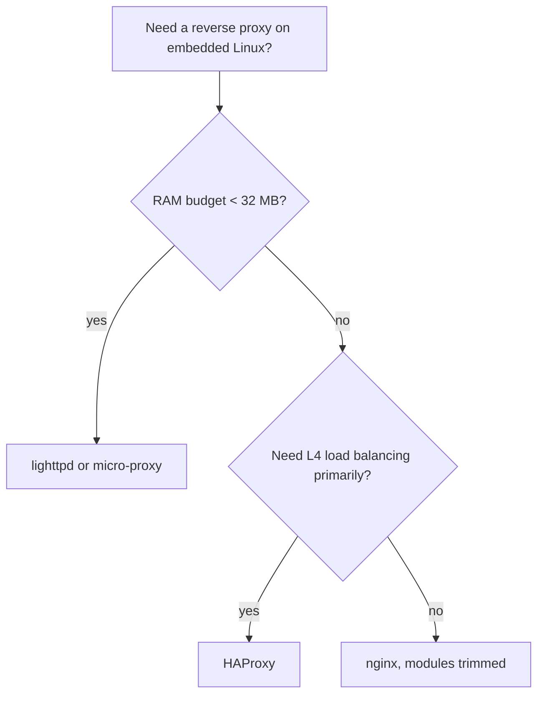
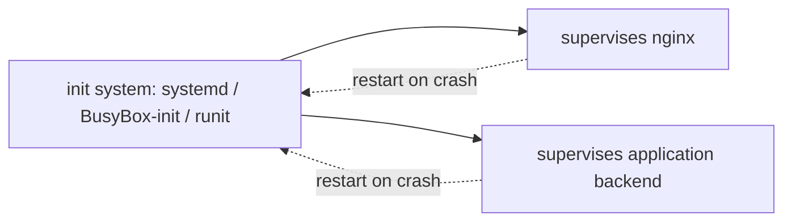
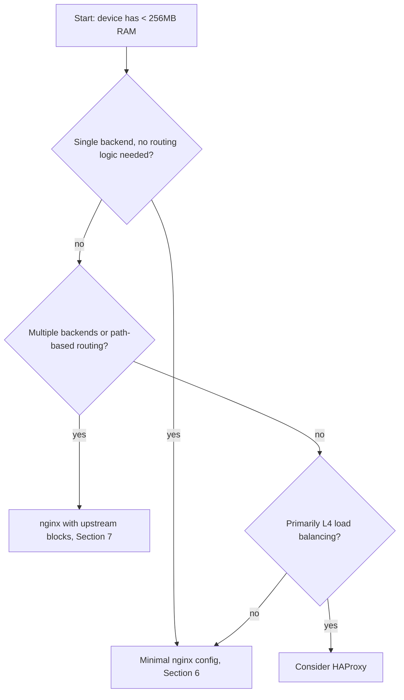

# Reverse Proxy (nginx or other) on Embedded Platforms — Zero to Hero
### A Manual of First Principles

> *Built from the ground up. Every concept earns its place. Every diagram exists because words alone would be longer.*

---

## Preface

Reverse-proxy documentation is written almost exclusively for server farms: machines with gigabytes of RAM, SSD-backed filesystems, and operators who can `apt install` their way out of any problem. Embedded platforms violate every one of those assumptions — flash storage measured in megabytes, RAM shared with the kernel and application stack, no package manager, no swap, and a power budget that punishes idle polling. Official nginx documentation does not discuss flash wear, read-only root filesystems, or the cost of a worker process on a single-core ARM SoC. This guide exists to fill that gap.

**Prerequisites.** This guide assumes familiarity with: Linux process and file permission models, TCP/IP and HTTP semantics, basic cross-compilation or buildroot/Yocto concepts, and command-line Linux administration. It does not re-teach HTTP.

**Scope and limits.** This guide does not cover: writing custom reverse-proxy software from scratch, Layer-4 load balancing at carrier scale, Kubernetes Ingress controllers, or WAF rule-writing. It treats nginx as the primary reference implementation (it is the dominant choice on embedded Linux) and treats Caddy, HAProxy, lighttpd, and micro-proxies as comparative alternatives only where the comparison clarifies a principle.

**Competence map.** After Part II you will be able to reason correctly about whether a given embedded target *can* run a reverse proxy at all. After Part III you will be able to write and justify a working configuration. After Part V you will be able to ship and operate one in production.

---

## Table of Contents

- Part I — Orientation
  - 1. What a Reverse Proxy Is, and Why "Embedded" Changes the Question
  - 2. Taxonomy of Reverse Proxy Software for Constrained Targets
- Part II — The Constraint Model
  - 3. Resource Axes: CPU, RAM, Flash, Power
  - 4. Process and Memory Model Under Constraint
  - 5. TLS on Constrained Hardware
- Part III — Configuration and Implementation
  - 6. Minimal Viable Reverse Proxy Configuration
  - 7. Routing and Upstream Management
  - 8. Caching Under Flash Constraints
  - 9. Connection and Buffer Tuning
- Part IV — Cross-Cutting Concerns
  - 10. Security Hardening
  - 11. Observability With Minimal Overhead
  - 12. Supervision and Init Integration
- Part V — Production
  - 13. Build System Integration (Buildroot / Yocto)
  - 14. Failure Modes and Resilience
  - 15. Performance Tuning Checklist
- Appendices
  - A — Directives and Variables to Memorize
  - B — Glossary
  - C — Decision Tree: Which Proxy, Which Mode
  - D — References

---

# Part I — Orientation

## 1. What a Reverse Proxy Is, and Why "Embedded" Changes the Question

**Formal definition.** A reverse proxy is a network intermediary that accepts requests on behalf of one or more backend services, forwards them according to routing rules, and returns the backend's response to the client as if the proxy itself had produced it. The client only ever addresses the proxy; the backend topology is hidden.

```
┌──────────┐        ┌────────────────────┐        ┌─────────────┐
│  Client  │ ─────▶ │   Reverse Proxy    │ ─────▶│  Backend A  │
│ (browser)│        │ (single endpoint)  │ ─────▶ │  Backend B  │
└──────────┘        └────────────────────┘        └─────────────┘
        client sees ONE address      proxy sees the real topology
```

On a server, the proxy is one process among many, competing for abundant resources. On an embedded platform, the proxy is frequently **the single most resource-hungry userspace process on the device**, running alongside the application logic it is meant to protect, on hardware that was sized for that application logic — not for an HTTP intermediary. The reverse proxy is therefore not a free architectural layer; it is a resource trade that must be justified.

> **Principle 1.** *A reverse proxy is justified on an embedded target only when the problem it solves (TLS termination, multiplexing, request filtering, static asset offload) costs less in CPU/RAM/flash than solving that problem inside the application itself.*

This reframes every later decision: each feature of nginx or any alternative will be evaluated not by "is it useful" but by "does it earn its footprint."

## 2. Taxonomy of Reverse Proxy Software for Constrained Targets

> **Principle 2.** *Reverse proxy software for embedded targets is selected by binary footprint and runtime memory model first, feature breadth second — because a feature you cannot afford to run is not a feature.*

| Software | Binary size (stripped, typical) | Runtime model | Config format | Notable embedded fit |
|---|---|---|---|---|
| nginx | ~1.0–1.5 MB | master + worker processes (fork) | declarative DSL | Reference choice; widely available in buildroot/Yocto recipes |
| nginx (mod-minimal build) | ~400–700 KB | same, modules stripped | declarative DSL | Recommended for flash-constrained targets |
| lighttpd | ~300–500 KB | single-process, event-driven | declarative DSL | Lower footprint, smaller module ecosystem |
| HAProxy | ~2–3 MB | single-process, event-driven | declarative DSL | Strong at L4/L7 load balancing, less suited to static content |
| Caddy | 15–25 MB (static Go binary) | single-process, goroutines | declarative/Caddyfile | Automatic TLS is convenient but the binary size and Go runtime overhead usually disqualify it below ~64 MB RAM targets |
| Traefik | 30–100+ MB | single-process, Go | declarative/dynamic | Designed for orchestrated/container fleets; rarely appropriate on bare embedded Linux |
| micro-proxies (e.g. `tinyproxy`, custom musl/nginx unit builds) | <300 KB | varies | minimal | Used when only a narrow subset of proxy behavior is needed |

The taxonomy collapses to one decision axis for most embedded work: **nginx with a trimmed module set** dominates the space because its memory model (Section 4) degrades gracefully under tuning, its configuration DSL is well documented, and cross-compilation recipes already exist in Buildroot and Yocto (`meta-networking`).



---

# Part II — The Constraint Model

## 3. Resource Axes: CPU, RAM, Flash, Power

> **Principle 3.** *Every embedded reverse-proxy decision is a multi-axis trade between CPU cycles, resident memory, flash footprint, and power draw — optimizing one axis in isolation routinely worsens another.*

| Axis | What it limits | Typical embedded budget | Failure symptom when exceeded |
|---|---|---|---|
| CPU | requests/sec, TLS handshake rate | single core, 200 MHz–1.5 GHz, often shared with app logic | latency spikes, dropped connections under load |
| RAM | worker count, buffer sizes, cache size | 16–256 MB total system RAM | OOM-killer terminates the proxy or the application |
| Flash | binary + module + log + cache size | 4–64 MB usable partition, often read-mostly | mount failures, wear-out on logging-heavy configs |
| Power | always-on network listening, polling intervals | battery or PoE-limited devices | premature battery drain, thermal throttling |

```
        CPU ───────┐
                    │
        RAM ────────┼──── trade space ──── single deployable config
                    │
      Flash ────────┤
                    │
      Power ────────┘
```

Each subsequent section of this guide returns to this table: a tuning knob is never described without naming which axis it spends and which it saves.

## 4. Process and Memory Model Under Constraint

**Formal model.** nginx's default architecture is one master process plus N worker processes, each handling many connections via an event loop (epoll/kqueue), not one thread per connection.

```
┌───────────────┐
│ master process│  reads config, binds sockets, manages workers
└──────┬────────┘
       │ fork()
┌──────▼────────┐  ┌───────────────┐
│ worker 1      │  │ worker N      │   each: single-threaded event loop
│ (event loop)  │  │ (event loop)  │   handles thousands of connections
└───────────────┘  └───────────────┘
```

> **Principle 4.** *On a single-core embedded target, more than one worker process buys nothing but duplicated baseline memory — the event-driven model already saturates a single core before context-switch overhead between workers becomes profitable.*

Implementation — pin worker count to core count, explicitly, rather than trusting the `auto` default which can over-provision on hyper-threaded build hosts whose `nproc` does not match the target:

```nginx
# nginx.conf — minimal process model for a single-core target
worker_processes 1;          # one core => one worker; do NOT use "auto" cross-build
worker_rlimit_nofile 1024;   # cap matches embedded fd limits; do not request what the kernel can't grant
events {
    worker_connections 512;  # 512 conns * ~2-4KB buffer state ≈ acceptable RAM cost; see Section 9
    use epoll;                # explicit: epoll is the correct backend on Linux, avoid select() fallback
}
```
*Each line is annotated above; nothing here is decorative — `worker_rlimit_nofile` and `worker_connections` together bound the worst-case memory ceiling of the proxy, which is the number that must fit the RAM budget from Section 3.*

## 5. TLS on Constrained Hardware

> **Principle 5.** *TLS termination cost is dominated by the handshake (asymmetric crypto), not the bulk cipher — so embedded TLS tuning targets handshake frequency and key-exchange algorithm choice, not symmetric cipher selection.*

```
Client                          Proxy (embedded CPU)
  │  ClientHello                    │
  ├─────────────────────────────────▶
  │                                  │  ECDHE key exchange  ◄── CPU-expensive step
  │  ServerHello + cert + key share  │
  ◄─────────────────────────────────┤
  │  Finished                        │
  ├─────────────────────────────────▶
  │  ── application data (AES-GCM) ──│  ◄── cheap relative to handshake
```

Practical levers, each tied to the principle above:

| Lever | Effect | Axis spent | Axis saved |
|---|---|---|---|
| Session resumption (`ssl_session_cache`, tickets) | Skips full handshake on repeat clients | small RAM (cache table) | CPU (handshake skipped) |
| Prefer ECDSA over RSA certificates | Faster signature ops | none significant | CPU |
| `ssl_protocols TLSv1.2 TLSv1.3;` only | Drops costly legacy negotiation paths | none | CPU, flash (no legacy cipher code paths needed) |
| Hardware crypto offload (if SoC provides AES-NI equivalent / crypto engine) | Moves bulk cipher to silicon | none (uses existing silicon) | CPU |

```nginx
# Minimal viable TLS block for an embedded nginx reverse proxy
ssl_protocols TLSv1.2 TLSv1.3;             # principle 5: eliminate legacy handshake cost
ssl_session_cache shared:SSL:1m;           # ~1MB cache; sized for tens of resumable sessions, not thousands
ssl_session_timeout 10m;                   # bounds cache growth; stale sessions evicted
ssl_prefer_server_ciphers off;             # TLS1.3 negotiates this; directive kept for TLS1.2 fallback clarity
```

---

# Part III — Configuration and Implementation

## 6. Minimal Viable Reverse Proxy Configuration

> **Principle 6.** *A configuration is minimal-viable when removing any further directive changes observable behavior — every line present must be load-bearing.*

```nginx
# /etc/nginx/nginx.conf — minimal viable embedded reverse proxy
user nobody;                      # never run worker as root on a device with persistent storage
worker_processes 1;                # principle 4
pid /run/nginx.pid;                # /run is tmpfs on most embedded distros: no flash wear

events {
    worker_connections 512;
    use epoll;
}

http {
    access_log off;                # principle: logging to flash is a wear+space cost; off by default
    error_log /dev/null emerg;     # suppress unless an operator opts in (Section 11 enables this deliberately)

    server {
        listen 80;
        location / {
            proxy_pass http://127.0.0.1:8080;   # the single backend this device exists to expose
            proxy_set_header Host $host;        # preserves original Host header for the backend
            proxy_set_header X-Real-IP $remote_addr;  # backend needs real client IP, not the proxy's
        }
    }
}
```
*This is the entire file required for a device with one backend service and no TLS. Every directive maps to a principle stated earlier; nothing is included "to be safe."*

## 7. Routing and Upstream Management

> **Principle 7.** *Routing logic belongs in the proxy only when more than one backend exists behind a single external endpoint — a single-backend device should not carry multi-backend routing machinery it will never use.*

```
                    ┌────────────────────────┐
  /api/*  ────────▶ │                        │ ───▶ backend:8080 (app logic)
                    │   nginx location match │
  /static/* ──────▶ │   (longest-prefix wins)│ ───▶ filesystem (Section 8)
                    └────────────────────────┘
```

```nginx
upstream app_backend {
    server 127.0.0.1:8080;
    keepalive 8;              # reuse TCP connections to backend; saves CPU on repeated SYN/handshake
}

server {
    listen 80;

    location /api/ {
        proxy_pass http://app_backend;
        proxy_http_version 1.1;        # required for keepalive to upstream
        proxy_set_header Connection ""; # clears client's Connection header so keepalive to backend works
    }

    location /static/ {
        root /opt/www;                  # served directly, no backend round-trip — see Section 8
        expires 1h;
    }
}
```
*The `keepalive` directive is the only addition over Section 6's minimal config that is justified purely by routing complexity: once more than one location block exists, repeated upstream connection setup becomes measurable overhead worth amortizing.*

## 8. Caching Under Flash Constraints

> **Principle 8.** *Caching on embedded storage trades flash write-endurance against CPU/network cost — and because flash write-endurance is finite and non-renewable, this trade is asymmetric with server-grade caching, where SSD endurance is effectively not a constraint.*

| Cache target | Server-grade default | Embedded-correct choice | Reason |
|---|---|---|---|
| Proxy response cache (`proxy_cache_path`) | on disk, large | on tmpfs (RAM-backed), small, or disabled | avoids flash write cycles entirely |
| Static asset serving | filesystem read | filesystem read, read-only mount | reads do not wear flash; writes do |
| Log rotation | daily, on disk | disabled or ring-buffer in RAM | logs are append-heavy writes — the worst pattern for flash wear |

```nginx
proxy_cache_path /tmp/nginx_cache levels=1:2 keys_zone=embedded_cache:2m max_size=8m;
# /tmp is tmpfs (RAM) on most embedded Linux distros: cache lives in RAM, evaporates on reboot,
# and never touches flash. keys_zone sized at 2MB; max_size capped at 8MB — both chosen to fit
# comfortably inside a RAM budget of tens of MB, per Principle 3.

server {
    location /api/ {
        proxy_pass http://app_backend;
        proxy_cache embedded_cache;
        proxy_cache_valid 200 30s;   # short TTL: embedded backends are usually local and fast to re-query
    }
}
```

## 9. Connection and Buffer Tuning

> **Principle 9.** *Every buffer directive in nginx allocates memory per-connection or per-worker — tuning buffers on embedded targets means setting the smallest value that does not force disk/tmp spillover, not the largest value that "performs well."*

```
worker RAM footprint ≈ base_worker_memory
                       + (worker_connections × per_connection_buffers)
                       + (cache_keys_zone_size)
```

| Directive | Server-grade default | Embedded tuning | Axis affected |
|---|---|---|---|
| `client_body_buffer_size` | 8k–16k | 8k (rarely needs raising for embedded APIs) | RAM |
| `proxy_buffers` | `8 4k` | `4 4k` | RAM |
| `large_client_header_buffers` | `4 8k` | `2 4k` unless headers are known to be large | RAM |
| `keepalive_timeout` | 75s | 15–30s | RAM (fewer idle connections held open), Power (fewer idle wakeups) |

```nginx
client_body_buffer_size 8k;
proxy_buffers 4 4k;
large_client_header_buffers 2 4k;
keepalive_timeout 20s;
```
*Each value above is a floor, not a default copy-paste: it must be validated against real traffic using the observability practices in Section 11 before shipping.*

---

# Part IV — Cross-Cutting Concerns

## 10. Security Hardening

> **Principle 10.** *On an embedded device, the reverse proxy is frequently the only network-facing process — its hardening is the device's hardening, not a layer on top of other defenses.*

```
Internet ──▶ [ Reverse Proxy ]──▶ backend (often bound to loopback only)
                     ▲
                     └── single point: if this is compromised, the device is compromised
```

| Hardening measure | Implementation | Principle link |
|---|---|---|
| Run as unprivileged user | `user nobody;` | least privilege — a compromised worker cannot write to root-owned flash regions |
| Bind backend to loopback only | backend listens on `127.0.0.1`, not `0.0.0.0` | the proxy becomes the sole network ingress point, matching Principle 10 |
| Disable unused HTTP methods | `limit_except GET POST { deny all; }` | reduces attack surface proportional to actual API contract |
| Rate limiting | `limit_req_zone`, `limit_req` | protects CPU/RAM budget (Section 3) from being exhausted by a single abusive client — security and resource-constraint concerns converge here |
| Read-only root filesystem compatibility | config and binary on read-only partition; only `/tmp`, `/run`, `/var/run` writable | prevents persistent compromise from surviving reboot |

```nginx
limit_req_zone $binary_remote_addr zone=embedded_limit:1m rate=10r/s;
# 1MB zone tracks roughly tens of thousands of distinct client states — generous for a typical
# embedded device's expected client population, and a negligible RAM cost.

server {
    location /api/ {
        limit_req zone=embedded_limit burst=20 nodelay;
        proxy_pass http://app_backend;
    }
}
```

## 11. Observability With Minimal Overhead

> **Principle 11.** *Observability is enabled by exception on embedded targets, not by default — because the default cost (continuous flash writes from logging) usually exceeds the value of logs that are rarely read.*

```
┌─────────────┐   opt-in    ┌─────────────────┐
│ nginx access │ ─────────▶ │ RAM ring buffer  │ ──▶ pulled by operator on demand, never auto-persisted
│   events     │            │ (syslog to tmpfs)│
└─────────────┘             └─────────────────┘
```

```nginx
# Logging disabled by default (Section 6). When diagnosis is needed, enable scoped, bounded logging:
error_log /var/log/nginx/error.log warn;   # mounted on tmpfs in production images
access_log /var/log/nginx/access.log combined buffer=16k flush=5s;
# buffer+flush batches writes rather than writing per-request — reduces flash wear if /var/log
# is ever flash-backed, and reduces syscall overhead either way.
```

`nginx -s reload` after editing this block enables logging without a restart, so observability can be toggled on transiently during field diagnosis and off again afterward — consistent with the opt-in principle.

## 12. Supervision and Init Integration

> **Principle 12.** *The reverse proxy must be supervised by the same mechanism that supervises the rest of the device's userspace — a bespoke supervision path for the proxy alone creates a second failure domain to reason about.*



systemd unit (when the target runs systemd):

```ini
# /etc/systemd/system/nginx.service
[Unit]
Description=Embedded reverse proxy
After=network.target

[Service]
ExecStartPre=/usr/sbin/nginx -t          # validate config before committing to a start
ExecStart=/usr/sbin/nginx -g 'daemon off;'  # foreground mode: systemd tracks the actual process, not a forked daemon
ExecReload=/usr/sbin/nginx -s reload
Restart=on-failure
RestartSec=2

[Install]
WantedBy=multi-user.target
```
*`daemon off;` is the load-bearing line here: without it, systemd supervises a process that immediately forks and exits, defeating `Restart=on-failure`.*

For BusyBox-init based images, the equivalent is an `/etc/inittab` respawn entry running nginx in the same foreground mode, since BusyBox-init has no separate "service" abstraction to delegate to.

---

# Part V — Production

## 13. Build System Integration (Buildroot / Yocto)

> **Principle 13.** *Reverse proxy software must be built from the same toolchain and libc as the rest of the image — mixing a vendor-provided glibc nginx binary with a musl-based root filesystem reintroduces exactly the dependency fragility embedded builds exist to eliminate.*

```
┌───────────────┐     ┌──────────────────┐     ┌───────────────────┐
│ Buildroot/Yocto│ ──▶ │ cross-toolchain   │ ──▶ │ nginx binary linked│
│ recipe/config  │     │ (matches target  │     │ against target's   │
│                │     │  libc: musl/glibc)│     │  libc, not host's │
└───────────────┘     └──────────────────┘     └───────────────────┘
```

Buildroot: enable via menuconfig (`Target packages → Networking applications → nginx`), then trim modules at the package's `.mk` level to remove unused HTTP modules (`--without-http_autoindex_module`, etc.) — each disabled module reduces both binary size (flash axis) and attack surface (Section 10).

Yocto: recipe lives in `meta-networking/recipes-connectivity/nginx/nginx_*.bb`; module selection is controlled through `PACKAGECONFIG` flags in the recipe, which map to the same `./configure --without-*` flags Buildroot uses underneath — the two build systems converge on identical upstream nginx build options.

## 14. Failure Modes and Resilience

> **Principle 14.** *An embedded reverse proxy must fail toward a known-safe state (no service) rather than an unknown state (corrupted config, partial restart) — because there is usually no remote operator available to intervene.*

| Failure mode | Cause on embedded targets specifically | Mitigation |
|---|---|---|
| OOM kill | worker memory exceeds RAM budget under load spike | `worker_connections` capped (Section 4), `vm.overcommit_memory` tuned, supervised restart (Section 12) |
| Config corruption after power loss mid-write | flash write interrupted by sudden power-off (common on embedded, rare on servers with UPS) | config delivered read-only / read-only root partition; updates via atomic A/B partition swap, not in-place edit |
| Flash exhaustion from logs | unattended logging left enabled (Section 11 misconfigured) | logging off by default; bounded buffer sizes; external log shipping if persistence is required |
| Backend unreachable | application crash loop independent of proxy | `proxy_next_upstream`, health-check style retry with bounded attempts, fail fast to a static error page rather than hanging connections |

```nginx
location /api/ {
    proxy_pass http://app_backend;
    proxy_connect_timeout 2s;     # fail fast: embedded backends are local, slow connect == backend is down
    proxy_next_upstream error timeout;
    error_page 502 503 504 /maintenance.html;  # known-safe static fallback, served from flash, no backend dependency
}
```

## 15. Performance Tuning Checklist

> **Principle 15.** *Tuning is validated by measurement on the actual target hardware, never by copying server-grade benchmarks — embedded CPUs, memory controllers, and storage have different bottleneck profiles than the hardware most published benchmarks run on.*

| Step | Tool | What it validates |
|---|---|---|
| 1. Baseline idle RAM | `free`, `cat /proc/<pid>/status` | confirms Section 4's worker memory model matches reality on this SoC |
| 2. Load test from a LAN client | `wrk`, `ab` (run off-device, never on the constrained CPU itself) | confirms `worker_connections` and buffer sizing under realistic concurrency |
| 3. Flash write monitoring | `iostat`, vendor wear-leveling counters | confirms logging/caching choices (Sections 8, 11) are not silently writing to flash |
| 4. TLS handshake rate | `openssl s_time`, repeated `curl` against the proxy | confirms session resumption (Section 5) is actually being hit, not silently bypassed |
| 5. Power draw under load | bench power meter on the device's supply rail | confirms idle keepalive/timeout tuning (Section 9) translates to real power savings |

---

# Appendices

## Appendix A — Directives and Variables to Memorize

| Directive/Variable | Purpose | Section |
|---|---|---|
| `worker_processes` | Process count; pin to core count | 4 |
| `worker_connections` | Per-worker connection ceiling; RAM-bounding | 4 |
| `ssl_session_cache` | Handshake cost reduction via resumption | 5 |
| `proxy_cache_path` | Response caching; place on tmpfs on embedded | 8 |
| `proxy_buffers` | Per-connection buffer memory | 9 |
| `limit_req_zone` | Rate limiting; security + resource protection | 10 |
| `access_log` / `error_log` | Opt-in logging; off by default | 11 |
| `proxy_connect_timeout` | Fail-fast backend health behavior | 14 |

## Appendix B — Glossary

| Term | Definition |
|---|---|
| Reverse proxy | Intermediary that accepts requests on a backend's behalf and forwards them per routing rules |
| Worker process | nginx's unit of concurrency; one event loop per worker |
| Flash wear | Degradation of NAND flash from repeated write/erase cycles; finite and non-renewable |
| tmpfs | RAM-backed filesystem; writes do not persist or wear flash |
| TLS session resumption | Mechanism to skip full handshake for returning clients |
| Read-only root filesystem | Embedded pattern where `/` is mounted read-only to prevent corruption and unauthorized persistence |

## Appendix C — Decision Tree: Which Proxy, Which Mode



## Appendix D — References

- nginx official documentation: `https://nginx.org/en/docs/`
- Buildroot manual, networking packages: `https://buildroot.org/downloads/manual/manual.html`
- Yocto Project reference manual: `https://docs.yoctoproject.org/`
- HAProxy documentation: `https://www.haproxy.org/#docs`
- lighttpd documentation: `https://redmine.lighttpd.net/projects/lighttpd/wiki`
